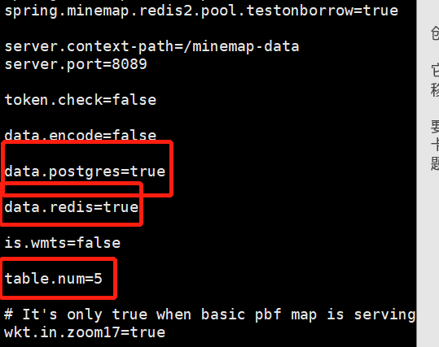
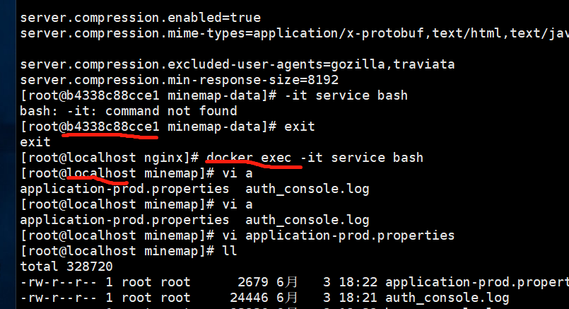
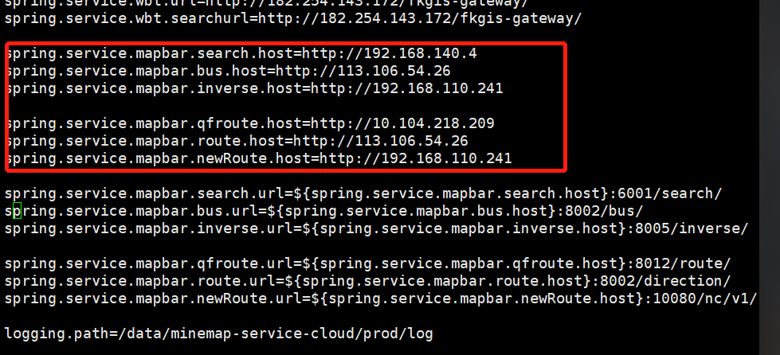
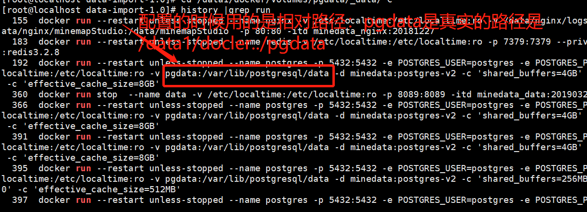

跳到内容
 
Search or jump to…

拉请求
问题
市井
探索
 
@jiajiales 
0
1 0 jiajiales / studyNotes 私人
 代码 问题29 拉取请求0 项目 0 安全 洞察 设置   
studyNotes /面经 /minemap部署
@jiajiales jiajiales 创建minemap部署
5b8cf2f
4分钟前
695行（384 sloc）  17.4 KB
    
泊坞窗安装
==========

如图1所示，环境准备阶段 
----------------

1，df -hT
查看可用磁盘，需要超过300G以上磁盘-----------------如需要，手动配置分区
mkfs.ext3 ----格式化命令。查看内存free -h需要64G

2，确认系统版本，并上传对应的镜像文件ISO，挂载，编写荫源

[root \ @localhost data] \ #cat / etc / redhat-release

CentOS Linux版本7.5.1804（核心版）

[root \ @localhost data] \＃mount -o loop /data/CentOS-7-x86_64-DVD-1810-7.6.iso
到/ mnt /

查看挂载命令？------ df -h（可查看空间挂载情况）

（遗留问题：中间需要删除什么文件来着-------------需要删除yum.repos.d文件下的文件重新创建）

\> filename：清空文件命令

（loop代表去根文件找/ mnt前面是有空格的如果当前的目录有ISO镜像：mount -o
CentOS-7-x86_64-DVD-1810-7.6.iso / mnt /）

vi /etc/yum.repos.d/centos.repo

[centos7.6]

名称= centos7.6

baseURL时=文件：/// MNT

gpgcheck = 0

启用= 1

（遗留问题：对应文件是挂载在哪对应在哪吗？是的）

备注：gpkcheck = 0表示对从这个源下载的rpm包不进行校验;

enable = 1表示启用这个源。

安装GCC，测试本地百胜源是否成功。

百胜清洁一切

yum install telnet

yum install -y gcc gcc-c ++

2，关掉所有防火前
-----------------

firewalld（7.0以上版本）iptables selinux getenforce ---- \>查看selinux状态的

vi / etc / selinux / config ------------- \> \> \> SELINUX = disabled ---需要重启

service stop firewalld / systemctl stop firewalld ------停止防火墙

systemctl禁用firewalld.service -----开机不启动防火墙

查看防火墙状态：firewall-cmd -state

\ -----如：非泊坞窗形式安装的Redis和Postgres的

\  -  3，安装redis的-4.0.10（）

yum -y install gcc gcc -c ++ glibc ----------安装基础环境

tar zxvf redis-4.0.10.tar.gz ---解压redis

ln -s /data/redis-4.0.10/ / data / redis ----做软连接

cd / data / redis

make && make install -----安装redis

mv redis.conf 7379.conf ----重名命

vi 7379.conf ----- \>详见部署文档

cp / data / redis / utils / redis_init_script /etc/init.d/redis -----制作开机启动redis

chmod a + x /etc/init.d/redis

vi /etc/init.d/redis

chkconfig redis on

service redis start -----启动redis

\  -  3，Postgres的----------详见部署文档

安装了PostGIS

yum -y install libxml2-devel

3，开始安装搬运工
-----------------

在线安装

确认联网，ping 114.114.114.114（通）ping www.baidu.com（不通）

vi /etc/resolv.conf --------配置DNS服务器

名称服务器114.114.114.114

ping www.baidu.com

联网百度https://blog.csdn.net/qq_21816375/article/details/79832593

cd /etc/yum.repos.d/  - 删除所有文件（或者备份）

wget http://mirrors.163.com/.help/CentOS6-Base-163.repo

yum install -y yum-utils device-mapper-persistent-data lvm2  - 驱动依赖

yum-config-manager --add-repo
https://download.docker.com/linux/centos/docker-ce.repo ---安装docker的yum源

yum list docker-ce --showduplicates \| sort -r --查看所有docker版本

yum install docker-ce

离线安装

上传docker文件夹（docker18.9）：含有4个 rpm文件

yum -y install policycoreutils-python(安装python)

yum -y update selinux-policy（升级selinux-policy）

rpm -ivh container-selinux-2.95-2.el7_6.noarch.rpm

rpm -ivh containerd.io-1.2.5-3.1.el7.x86_64.rpm

rpm -ivh docker-ce-cli-18.09.5-3.el7.x86_64.rpm

yum -y install libseccomp(安装libseccomp）

rpm -ivh docker-ce-18.09.5-3.el7.x86_64.rpm

4、设置docker 开机启动
----------------------

systemctl enable docker.service

5、配置docker 
--------------

（创建一个docker文件夹：mkdir /etc/docker 最开始没有docker）
（遗留问题：这个配置的目的是？文件的地址要什么要求）

vi /etc/docker/daemon.json \#\#\# （docker 的根路径）

{

"graph":"/data/docker"

}

6、启动docker
-------------

service docker restart

关闭防火墙 systemctl disable firewalld （重启也关闭） （注意firewall后面有d）

最终目的 1.yum 开启（不用开机开启） 2.docker开启（开机启动systemctl disable
docker） 3.firewalld关闭(开机启动关掉）4.selinux（开机也关闭）
(遗留问题：selinux的作用是什么？---防火墙)

部署地图服务部分 
=================

准备工作：(创建几个目录)

/data/ ------nginx-----镜像.tar

\------前端工程.zip（解压：unzip minemapStudio.zip）

\-----map------service

\--------upload

\--------data

\-----pg

\-----redis

1、安装地图服务（地图部分）
---------------------------

docker load -i 6个地图镜像（docker.minedata.data.tar） \*.tar 命令

6个镜像： docker images（查看验证）

3个数据 (遗留问题：是不是3个数据文件---------是三个服务)

upload----- minedata:upload es minedata:data prot

service----- minedata:service

data------ minedata:data

3个服务：

pg-----

Redis---

Nginx-----

上传前端工程 minemapStudio.zip 解压到/data/nginx/

2、启动服务（地图部分）
-----------------------

\-------------minedata

(绿色的是不用改的

minedata:postgres-v2：是用docker images命令查看 对应的REPOSITORY:TAG)

docker run --restart unless-stopped --name postgres -p 5432:5432 -e
POSTGRES_USER=postgres -e POSTGRES_PASSWORD=superman -v
/etc/localtime:/etc/localtime:ro -v pgdata:/var/lib/postgresql/data -d
minedata:postgres-v2 -c 'shared_buffers=4GB' -c 'max_connections=1000' -c
'effective_cache_size=8GB'

(注意1：自己虚拟机的话不要设置这么大的空间4GB 8GB 512MB 就行了)

(注意2：-v pgdata:/var/lib/postgresql/data pgdata 是相对路径紫药水docker
run执行的命令就会放在 /data1/docker/volumes/下面 也就是实际上放在了-v
/data1/docker/volumes/pgdata:/var/lib/postgresql/data

/data1/docker/volumes/pgdata/_data/

后面导入数据的时候 要将数据和copy2脚本放在/data1/docker/volumes/pgdata/_data/中

)

(最后一行的含义？)

docker run --restart unless-stopped --name redis -v
/etc/localtime:/etc/localtime:ro -p 7379:7379 --privileged=true -itd
minedata:redis3.2.8

docker run --restart unless-stopped --name service -v
/etc/localtime:/etc/localtime:ro --net=host -p 16001:16001 -p 1001:1001 --device
/dev/mem:/dev/mem --cap-add=ALL --cap-drop=MKNOD -itd minedata:minemap

(注意需要将宿主机的前端工程minemapStudio挂载到docker里面,解压zip文件 unzip（yum
install unzip） \*.zip)

docker run --restart unless-stopped --name nginx -v
/etc/localtime:/etc/localtime:ro -v /data/nginx/logs/:/data/nginx/logs/ -v
/data/nginx/minemapStudio:/data/minemapStudio -p 80:80 -itd
minedata_nginx:20181227

docker run --restart unless-stopped --name data -v
/etc/localtime:/etc/localtime:ro -p 8089:8089 -itd minedata_data:20190320

docker run --restart unless-stopped --name upload -v
/etc/localtime:/etc/localtime:ro -p 8086:8086 -itd minedata:dataForUpload

（过程如果有错：docker rm -f postgres 删除从新执行docker run命令）

docker ps（查看验证）:

CONTAINER ID IMAGE COMMAND CREATED STATUS PORTS NAMES

bfc95078e4ee minedata:redis3.2.8 "sh start_all.sh" 5 minutes ago Up 4 minutes
0.0.0.0:7379-\>7379/tcp redis

f1eabf373a48 minedata_nginx:20181227 "sh start_all.sh" 3 hours ago Up 3 hours
0.0.0.0:80-\>80/tcp ngin

3、修改容器配置
---------------

### a.data服务 

进容器命令 docker exec -it data bash

vi app\*\*\*\*\*

修改位置：postgres for data

:%s/192.168.140.3/192.168.20.135/g

\# postgres for data

spring.minemap.pg.host=192.168.20.135

spring.minemap.pg.port=5432

spring.minemap.pg.database=mif

spring.minemap.pg.username=postgres

spring.minemap.pg.password=superman

如果数据需要导入pg则需要修改如下配置

table.num 对应pg导入的表数

pg.database 改成mif (改成数据库的名字---将名称起名为mif)

redis 和 postgres改成true

（每次进入容器之前要出来一下 exit）

### b.upload服务 

进容器命令 docker exec -it upload bash

vi app\*\*\*\*\*

修改位置：postgres for upload

:%s/192.168.140.3/192.168.20.136/g(可全替换) ---会改掉6个ip

### c.minemap服务 

进容器命令 docker exec -it service bash

vi app\*\*\*\*\*

:%s/192.168.140.3/192.168.20.136/g ---会改掉6个ip

需要修改lbs-ip 4/6 ---在哪? ??????? 要改成什么？？？

删除容器key文件，更换新的key ---key文件需要用 机器码或者mac生成

获取机器码：dmidecode -s system-serial-number

(eg: VMware-56 4d aa f4 77 51 4b 23-d7 c4 5e 75 59 32 55 29)，

>   另外一钟命令：dmidecode \| grep -i 'serial number'

VMware-42 0c d5 60 84 9f dc 67-b2 d7 93 ae 93 6d fb 75

如果没有机器码，则使用mac地址

ip addr ----------------------获取mac地址 怎么看mark地址？

docker cp /data/service/key service:/data/minemap/

### d.nginx服务 

进容器命令 docker exec -it nginx bash （退去命令 exit）

配置nginx服务

vi /data/nginx/conf/vhosts.conf （改为本机IP）

vi /data/nginx/conf/upstream.conf

:%s/192.168.140.3/192.168.254.25/g （会更改9个ip，端口已近配好不用配置）

配置前端页面

vi /data/minemapStudio/MineMapApiStudio/minemapapi/demo/index.html （87-98:7处ip
, 99:1处中心点坐标，140:ip）

:%s/192.168.140.3/192.168.20.135/g

vi /data/minemapStudio/MineMapStudio-ee/app/data/index/ee-data.json (前端标题)

vi /data/minemapStudio/MineMapStudio-ee/app/js/config.js （4处ip）

4、导入数据
-----------

（token-minemap.sql authorization.sql），导入数据（zip）

### a.导token

cp /data/base/\*.sql /data/docker/volumes/pgdata/_data/ --复制token到容器内

docker exec -it postgres bash ----进入容器

psql -U postgres minemap \</var/lib/postgresql/data/minemap.sql ---导入token

psql -U postgres auth \</var/lib/postgresql/data/authorization.sql ---导入token

### b.导入地图数据

docker exec -it postgres bash

课堂笔记：导入数据时可能会进入数据库去操作一些命令

进入: psql -U postgres

查看数据库 \\l

进入数据库 \\c auth

查看表 \\d （jnjj）

退出数据库：\\q

导入数据时将数据直接导入到pg 不用导入进去Redis让Redis自己去缓存

导入tool-1.0.jar 解压文件unzip data-import-1.0.zip

导入数据文件 解压文件unzip shijiazhuang-Minemappbf-19Q1-02_hdfs.zip

pwd查看当前路径 /data1/database/7731555561532236/1555570420099 记住地址

切表（在/data1/database/data-import-1.0下执行 需要有tool-1.0.jar文集环境）

fie 5表示切5张表（一般切表原则小于1g的5张表 大的1g一张切表）

java -jar tool-1.0.jar /data1/database/7731555561532236/1555570420099/pbf file 5

切好之后需要将切好的表和脚本（copy2tables.sh:导出多张表的 导一张表用copy2table）
都放在docker下的（/data1/docker/volumes/pgdata/_data/）

解释为什么要放那里:

命令：history \|grep ru

执行脚本文件时需要 在postgres用户下执行

>   1.进入容器后（docker exec -it postgres bash）

>   2.进入/var/lib/postgresql/data

>   3.切换用户su postgres）

4./bin/bash copy2tables.sh pbf_organised/ mif 5432 5

（可有直接将数据导入到pg不用导Redis）

解压基础地图数据，找到pbf目录，使用程序导入redis （预先装yum install –y java）

java -jar tool-1.0.jar /data1/database/7731555561532236/1555570420099/pbf
postgres 20 192.168.20.136 7379 mif 5

LBS部分 
========

docker load -i 6个地图镜像（docker.routing.20190402.tar） \*.tar 命令

1、解压数据到对应目录，启动服务即可

docker run --restart unless-stopped --name route -p 10080:10080 -v
/etc/localtime:/etc/localtime:ro -v
/data/base/route/data:/navicore/route-server/data -d navicore:route_02_18Q2
--------------(84，02 数据是分开的)

docker run --restart unless-stopped --name inverse -p 8005:8005 -v
/etc/localtime:/etc/localtime:ro -v /data/base/inverse/data:/data -v
/data/base/inverse/index:/index -d navicore:inverse --------------(84，02
数据是分开的)

docker run --restart unless-stopped --name search -p 6001:6001
--mac-address=7c:d3:0a:c0:8f:d0 -v /etc/localtime:/etc/localtime:ro -v
/data/base/search/zhaoqieziindex:/zhaoqieziindex -d navicore_search:20181203
---------------------(84，02数据是整合的)

docker run --restart unless-stopped --name area02 -v
/etc/localtime:/etc/localtime:ro -v
/data/base/area/test.csv:/data/nacicore/area/mapx_area/data/test.csv -p
8001:8001 -d navicore:area02

search 默认是02数据，如需修改，需要进入容器内

docker exec -it search bash

vi /APP/mapbar/search/next-search/bin/config/system-config.properties

\#\#\#\#\#system.config.searcher.coordinate.system=02

路况部分 
=========

1、导入路况几何数据
-------------------

解压几何数据，找到pbf目录，使用程序导入redis

java -jar tool-1.0.jar /data/base/7751551233084098/1551235191963/pbf redis 20
10.194.33.30 7379 superman 10

2、安装沈阳接口服务
-------------------

参考路况服务部署手册.pptx

3、rtic服务
-----------

a.上传corresponding表到/data/base/rtic/rtic/20171206_17Q4_17M10W4_171023_crspd/province/correspondingOfhubei.csv

b.rtic根目录下创建poly.log ( vi /data/base/rtic/rtic/poly.log )

POLYGON ((113.47598 29.825458, 113.47598 31.508006, 115.288725 31.508006,
115.288725 29.825458, 113.47598 29.825458))

课堂笔记：（左下
–\>右上取两个点）-\>再生成四个点-\>放入的数据需要是顺时针放进去5个点（起点放在首尾两个位置）eg：图

\*

1.获取外网ip地址命令

curl ifconfig.me  
curl icanhazip.com  
curl ident.me

2.用ip去沈阳申请加入白名单（申请后沈阳会给个ip可以去请求数据）

3.测试白名单申请通过可不可返回数据

curl
"http://211.151.84.10:18080/TEGateway/1111/RTICTraffic.xml?bizcode=GanSuDiLiJianSheGongCheng&datatype=3&adcode=620100&format=0&mapversion=18Q3"

4.测试Tomcat（注意修改ip）

curl
"http://127.0.0.1:10080/TlrCnRticPublishService/cnrtic/services?x1=114.085947&y1=22.547&x2=114.109808&y2=22.565627&level=4&detail=0&mapversion=18Q2&gzip=0"

数据文件：

correspondingOfguangdong1.csv

当执行操作没有权限时：

chmod -R 755 /data/rtic/rtic/\*

rtic-需要修改的配置文件 ----poly.log （自己编辑） /
correspondingOfguangdong1.csv （申请下来的（数据组））/ rticonfig.properties

脚本文件

watch_log.sh

c.配置文件修改

envPath=/data/base/rtic/rtic/poly.log

crsPdPath=/data/base/rtic/rtic/20171206_17Q4_17M10W4_171023_crspd/province

\#数据库信息

host=10.194.33.30

port=7379

passwd=superman

urlBase=http://10.194.33.30:10080/TlrCnRticPublishService/cnrtic/services?

savePath=/data/base/rtic/rticfile

栅格图部署 
===========

参考栅格图部署文档.docx

linux 常用命令 
===============

yum clean all ----------清YUM缓存

文件中搜索命令：/home ----------搜索home n换下一个

查找文件命令 find / -name test

查看启动的端口: netstat –nlp

查看文集夹大小的命令 : du -h --max-depth=1

查看进程占用的端口：netstat -nap \ | grep pid

多级建立文件夹：mkdir -pa / b / c

解压多个文件和并成一个文件：  
例如linux.zip.001，linux.zip.002，linux.zip.003 ......  
首先cat linux.zip \ * \> linux.zip \＃合并为一个zip包  
然后解压linux.zip \＃解压zip包

虚拟机遇到的额外问题：

虚拟机最开的分配空间不足后面开机重启加上硬盘扩容
启动后看见的盘并没有新增空间的大小

使用命令：fdisk -l（查看盘符）

df -h（查看大小）

挂载：mount dev / sda2 / data1（将dev / sda2挂载在data1中实现互通）

查看：df -h

！[C：\\用户\\世纪高通\\应用程序数据\\本地\\温度\\ 1559618428（1）.PNG]（培养基/ 4096a36f31f99073227255ed3d141e76.png）

重启：systemctl重启docker

tail -f auth_console.log查看总日志

互信环境搭建
============

上传数据将8台机器做互信环境安装docker

一：8台机器的互信工作

1.ssh-keygen -t rsa（\＃下面一直按回车就好）

！[]（培养基/ 61fbc5234f620ce7b8979bcb71fc2647.png）

查看镜像：ls（cat / etc / redhat-release查看镜像？）

进入影藏文件：cd /root/.ssh/

查看秘钥：cat id_rsa.pub

！[C：\\用户\\世纪高通\\应用程序数据\\本地\\温度\\ 1559717497（1）.PNG]（培养基/ d9c5aaa8ad3981d479944a8a70a0e488.png）

创建一个文件：touch authorized_keys

！[C：\\用户\\世纪高通\\应用程序数据\\本地\\温度\\ 1559717773（1）.PNG]（培养基/ b48ddb77c0c34de67325e29b3bd258db.png）

将秘钥都放在一个文件中:(两台机器的话都要放，注意：粘贴的时候被少了字符什么的）

技巧：shift + g跳到最后一行shift + 4跳到最后一个字符

！[]（培养基/ a30c477a3708e32ba45073fc67fee4db.png）

测试：ssh 192.168.20.133

二，上传文件

三，安装搬运工

\ -----------------网关配置------------------------------ ---

文件：的ifcfg-ens33

TYPE =以太网

PROXY_METHOD =无

BROWSER_ONLY =无

BOOTPROTO =静态

DEFROUTE = YES

IPV4_FAILURE_FATAL =无

IPV6INIT = YES

IPV6_AUTOCONF = YES

IPV6_DEFROUTE = YES

IPV6_FAILURE_FATAL =无

IPV6_ADDR_GEN_MODE =稳定的隐私

NAME = ens33

UUID = 2c5d5257-b814-4333-be22-26676e660896

DEVICE = ens33

ONBOOT = YES

GATEWAY = 192.168.20.2

IPADDR = 192.168.20.135
©2019 GitHub，Inc。
条款
隐私
安全
状态
救命
联系GitHub
价钱
API
训练
博客
关于
