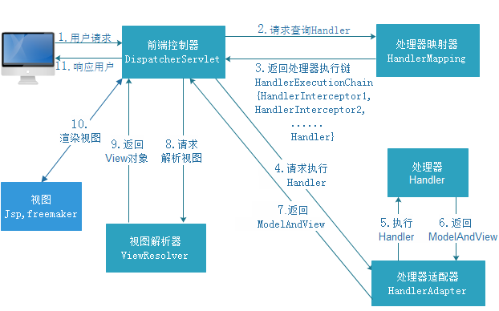
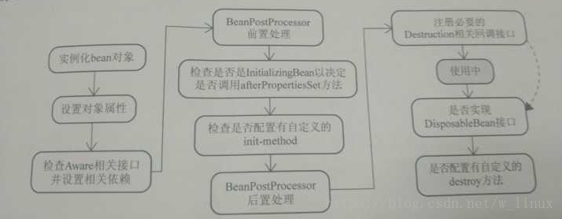

### SpringMVC:   
**框架结构如下图：**  
 
### Spring的面试题：

### 首先你需要知道的知识
在IoC容器启动之后，并不会马上就实例化相应的bean，此时容器仅仅拥有所有对象的BeanDefinition(BeanDefinition：是容器依赖某些工具加载的XML配置信息进行解析和分析，并将分析后的信息编组为相应的BeanDefinition)。只有当getBean()调用时才是有可能触发Bean实例化阶段的活动

#### 为什么说有可能触发Bean实例化阶段？

因为当对应某个bean定义的getBean()方法第一次被调用时，不管是显示的还是隐式的，Bean实例化阶段才会被触发，第二次被调用则会直接返回容器缓存的第一次实例化完的对象实例(因为默认是singleton单例，当然，这里的情况prototype类型的bean除外)

##该篇博客主要阐述
#### 1、Bean的一生过程
##### 2、Bean的后置处理器

### 一、Bean的一生过程
#### 先来看以下的图(Bean的一生)
 

#### 可以简述为以下九步

1.实例化bean对象(通过构造方法或者工厂方法)

2.设置对象属性(setter等)（依赖注入）

3.如果Bean实现了BeanNameAware接口，工厂调用Bean的setBeanName()方法传递Bean的ID。（和下面的一条均属于检查Aware接口）

4.如果Bean实现了BeanFactoryAware接口，工厂调用setBeanFactory()方法传入工厂自身

5.将Bean实例传递给Bean的前置处理器的postProcessBeforeInitialization(Object bean, String beanname)方法

6.调用Bean的初始化方法

7.将Bean实例传递给Bean的后置处理器的postProcessAfterInitialization(Object bean, String beanname)方法

8.使用Bean

9.容器关闭之前，调用Bean的销毁方法

**1 Spring 框架有哪些主要模块？**
Spring 框架至今已集成了 20 多个模块 。 这些模块主要被分如下图所示的核心容器 、 数据访问 / 集成 、Web、AOP （面向切面编程） 、 工具 、 消息和测试模块 。


**2 什么是依赖注入？什么是控制反转(IOC)？ 在 Spring 中，有几种依赖注入方式？**
依赖注入是在编译阶段尚未知所需的功能是来自哪个的类的情况下，将其他对象所依赖的功能对象实例化的模式。

在传统的编程方式中，业务逻辑的流程是由应用程序中的早已被设定好关联关系的对象来决定的。在使用控制反转的情况下，业务逻辑的流程是由对象关系图来决定的，该对象关系图由装配器负责实例化，这种实现方式还可以将对象之间的关联关系的定义抽象化。而绑定的过程是通过“依赖注入”实现的。

注入方式： 
* 构造器注入 
* Setter方法注入 
* 接口注入

**3 在 Spring 中，有几种配置 Bean 的方式？**
基于XML的配置
基于注解的配置
基于Java的配置
**4 请解释一下 Spring Bean 的生命周期？**
在一个 bean 实例被初始化时，需要执行一系列的初始化操作以达到可用的状态 。 同样的，当一个 bean 不在被调用时需要进行相关的析构操作，并从 bean 容器中移除 。 
Spring bean factory 负责管理在 spring 容器中被创建的 bean 的生命周期 。Bean 的生命周期由两组回调（call back）方法组成 。 
初始化之后调用的回调方法。 
销毁之前调用的回调方法。

**Spring 框架提供了以下四种方式来管理 bean 的生命周期事件：**
* InitializingBean 和 DisposableBean 回调接口 
* 针对特殊行为的其他 Aware 接口 
* Bean 配置文件中的 Custom init() 方法和 destroy() 方法 
* @PostConstruct 和 @PreDestroy 注解方式

**5 Spring Bean 有哪些作用域，它们之间有什么区别？**
singleton ：这种 bean 范围是默认的，这种范围确保不管接受到多少个请求，每个容器中只有一个 bean 的实例，单例的模式由 bean factory 自身来维护 。
prototype ：原形范围与单例范围相反，为每一个 bean 请求提供一个实例 。
request ：在请求 bean 范围内会每一个来自客户端的网络请求创建一个实例，在请求完成以后， bean 会失效并被垃圾回收器回收 。
Session ：与请求范围类似，确保每个 session 中有一个 bean 的实例，在 session 过期后， bean 会随之失效 。
global-session ： global-session 和 Portlet 应用相关 。 当你的应用部署在 Portlet 容器中工作时，它包含很多 portlet。 如果你想要声明让所有的 portlet 共用全局的存储变量的话，那么这全局变量需要存储在 global-session 中 。
**6 Spring 框架中的单例 Beans 是线程安全的么？**
实际上，大部分的 Spring bean 并没有可变的状态 ( 比如 Service 类和 DAO 类 ) ，所以在某种程度上说 Spring 的单例 bean 是线程安全的 。 如果你的 bean 有多种状态的话（比如 View Model 对象），就需要自行保证线程安全 。

**7 请解释一下，Spring 框架有哪些自动装配模式，它们之间有何区别？**
no ：这是 Spring 框架的默认设置，在该设置下自动装配是关闭的，开发者需要自行在 bean 定义中用标签明确的设置依赖关系 。
byName ：该选项可以根据 bean 名称设置依赖关系 。 当向一个 bean 中自动装配一个属性时，容器将根据 bean 的名称自动在在配置文件中查询一个匹配的 bean。 如果找到的话，就装配这个属性，如果没找到的话就报错 。
byType ：该选项可以根据 bean 类型设置依赖关系 。 当向一个 bean 中自动装配一个属性时，容器将根据 bean 的类型自动在在配置文件中查询一个匹配的 bean。 如果找到的话，就装配这个属性，如果没找到的话就报错 。
constructor ：构造器的自动装配和 byType 模式类似，但是仅仅适用于与有构造器相同参数的 bean ，如果在容器中没有找到与构造器参数类型一致的 bean ，那么将会抛出异常 。
autodetect ：该模式自动探测使用构造器自动装配或者 byType 自动装配 。 首先，首先会尝试找合适的带参数的构造器，如果找到的话就是用构造器自动装配，如果在 bean 内部没有找到相应的构造器或者是无参构造器，容器就会自动选择 byTpe 的自动装配方式 。
**8 Spring 框架中用到了哪些设计模式？请举例说明**
Spring 框架中使用到了大量的设计模式，下面列举了比较有代表性的：

代理模式 — 在 AOP 和 remoting 中被用的比较多 。

单例模式 — 在 spring 配置文件中定义的 bean 默认为单例模式 。

模板方法 — 用来解决代码重复的问题 。 比如 RestTemplate,   JmsTemplate,   JpaTemplate。

前端控制器 —Spring 提供了 DispatcherServlet 来对请求进行分发 。

视图帮助 (View Helper   )—Spring 提供了一系列的 JSP 标签，高效宏来辅助将分散的代码整合在视图里 。

依赖注入 — 贯穿于 BeanFactory   /   ApplicationContext 接口的核心理念 。

工厂模式 —BeanFactory 用来创建对象的实例 。

**9 说说 Springmvc 有哪些优点？**
它是基于组件技术的 . 全部的应用对象 , 无论控制器和视图 , 还是业务对象之类的都是 java 组件 . 并且和 Spring 提供的其他基础结构紧密集成 .
不依赖于 Servlet API( 目标虽是如此 , 但是在实现时确实是依赖于 Servlet 的 )
可以任意使用各种视图技术 , 而不仅仅局限于 JSP
支持各种请求资源的映射策略
它应是易于扩展的
**10 Spring 框架的事务管理有哪些优点？**
它为不同的事务 API 如 JTA ， JDBC ， Hibernate ， JPA 和 JDO ，提供一个不变的编程模式 。
它为编程式事务管理提供了一套简单的 API 而不是一些复杂的事务 API。
它支持声明式事务管理 。
它和 Spring 各种数据访问抽象层很好的集成 。
**11 AOP 的应用场景、原理 、AOP 好处？**
AOP–Aspect Oriented Programming 面向切面编程；用来封装横切关注点，具体可以在下面的场景中使用:

Authentication 权限
Caching 缓存
Context passing 内容传递
Error handling 错误处理
Lazy loading 懒加载
Debugging 调试
logging, tracing, profiling and monitoring 记录跟踪优化校准
Performance optimization 　性能优化
Persistence 持久化
Resource pooling 　资源池
Synchronization 　同步
Transactions 事务
原理： AOP 是面向切面编程，是通过动态代理的方式为程序添加统一功能，集中解决一些公共问题 。

优点： 
* 各个步骤之间的良好隔离性耦合性大大降低 。 
* 源代码无关性，再扩展功能的同时不对源码进行修改操作。

**12 Spring 中常见的创建对象的注解有哪些？**

@Service用于标注业务层组件、   
@Controller用于标注控制层组件（如struts中的action）  
@Repository用于标注数据访问组件，即DAO组件。   
@Component泛指组件，当组件不好归类的时候，我们可以使用这个注解进行标注。  

@Autowired 默认按类型装配，如果我们想使用按名称装配，可以结合@Qualifier注解一起使用。如下：   
@Autowired @Qualifier("personDaoBean") 存在多个实例配合使用   
@Resource默认按名称装配，当找不到与名称匹配的bean才会按类型装配。

**13 Spring 管理事务的方式有几种？** 
1、编程式事务，在代码中硬编码。(不推荐使用)   

2、声明式事务，在配置文件中配置（推荐使用）

声明式事务又分为两种：

a、基于XML的声明式事务

b、基于注解的声明式事务

**14 spring 中的核心类有那些，各有什么作用？**
BeanFactory：产生一个新的实例，可以实现单例模式。

BeanWrapper：提供统一的 get 及 set 方法。

ApplicationContext：提供框架的实现，包括 BeanFactory 的所有功能。

**15 spring 中有哪些代理方式？实现原理是什么？这些方式的优缺点是什么？**
1、若目标对象实现了若干接口， spring 使用 JDK 的 java.lang.reflect.Proxy 类代理 。

优点：因为有接口，所以使系统更加松耦合

缺点：为每一个目标类创建接口
2、若目标对象没有实现任何接口， spring 则使用 CGLIB 库生成目标对象的子类 。

优点：因为代理类与目标类是继承关系，所以不需要有接口的存在 。

缺点：因为没有使用接口，所以系统的耦合性没有使用 JDK 的动态代理好 。

**16 说说 IoC 容器的初始化过程？**
Resource 定位：我们一般使用外部资源来描述 Bean 对象，所以 IOC 容器第一步就是需要定位 Resource 外部资源 。Resource 的定位其实就是 BeanDefinition 的资源定位，它是由 ResourceLoader 通过统一的 Resource 接口来完成的，这个 Resource 对各种形式的 BeanDefinition 的使用都提供了统一接口 。
载入：第二个过程就是 BeanDefinition 的载入 ,BeanDefinitionReader 读取 , 解析 Resource 定位的资源，也就是将用户定义好的 Bean 表示成 IOC 容器的内部数据结构也就是 BeanDefinition, 在 IOC 容器内部维护着一个 BeanDefinition Map 的数据结构，通过这样的数据结构， IOC 容器能够对 Bean 进行更好的管理 。 在配置文件中每一个都对应着一个 BeanDefinition 对象 。
注册：第三个过程则是注册，即向 IOC 容器注册这些 BeanDefinition ，这个过程是通过 BeanDefinitionRegistery 接口来实现的 。
**17 说说 BeanFactory 和 ApplicationContext 的区别？ 什么是延迟实例化，它的优缺点是什么？**
BeanFactory 是 Spring 里面最低层的接口，提供了最简单的容器的功能，只提供了实例化对象和获取对象的功能 。

两者装载 bean 的区别
* BeanFactory ：在启动时不会去实例化 Bean ，只有从容器中获取 Bean 时才会去实例化。 
* ApplicationContext ：在启动的时候就把所有的 Bean 全部实例化了 。 它还可以为 Bean 配置 lazy-init=true 来让 Bean 延迟实例化。

延迟实例化
优点： 应用启动时占用资源很少，对资源要求较高的应用，比较有优势。 
缺点：速度会相对来说慢一些 。 而且有可能会出现空指针异常的错误，而且通过 bean 工厂创建的 bean 生命周期会简单一些。 所有的 Bean 在启动的时候都加载，系统运行的速度快，而且可以尽早的发现系统中的配置问题 。

建议 web 应用，在启动的时候就把所有的 Bean 都加载了 。

**18 说说 AOP 的实现原理？动态代理的方式有哪些？**
Spring AOP 使用的是动态代理，所谓的动态代理就是说 AOP 框架不会去修改字节码，而是在内存中临时为方法生成一个 AOP 对象，这个 AOP 对象包含了目标对象的全部方法，并且在特定的切点做了增强处理，并回调原对象的方法 。

Spring AOP 中的动态代理主要有两种方式， JDK 动态代理和 CGLIB 动态代理 。 
* JDK 动态代理通过反射来接收被代理的类，并且要求被代理的类必须实现一个接口 。JDK 动态代理的核心是 InvocationHandler 接口和 Proxy 类 。 
* 如果目标类没有实现接口，那么 Spring AOP 会选择使用 CGLIB 来动态代理目标类 。CGLIB （ Code Generation Library ），是一个代码生成的类库，可以在运行时动态的生成某个类的子类，注意， CGLIB 是通过继承的方式做的动态代理，因此如果某个类被标记为 final ，那么它是无法使用 CGLIB 做动态代理的 。


### Mybatis

**1、什么是mybatis？** 

（1）mybatis是一个优秀的基于java的持久层框架，它内部封装了jdbc，使开发者只需要关注sql语句本身，而不需要花费精力去处理加载驱动、创建连接、创建statement等繁杂的过程。

（2）mybatis通过xml或注解的方式将要执行的各种statement配置起来，并通过java对象和statement中sql的动态参数进行映射生成最终执行的sql语句，最后由mybatis框架执行sql并将结果映射为java对象并返回。

（3）MyBatis 支持定制化 SQL、存储过程以及高级映射。MyBatis 避免了几乎所有的 JDBC 代码和手动设置参数以及获取结果集。MyBatis 可以使用简单的 XML 或注解来配置和映射原生信息，将接口和 Java 的 POJO映射成数据库中的记录。

 

**2、Mybait的优点：** 

（1）简单易学，容易上手（相比于Hibernate） —- 基于SQL编程；

（2）JDBC相比，减少了50%以上的代码量，消除了JDBC大量冗余的代码，不需要手动开关连接；

（3）很好的与各种数据库兼容（因为MyBatis使用JDBC来连接数据库，所以只要JDBC支持的数据库MyBatis都支持，而JDBC提供了可扩展性，所以只要这个数据库有针对Java的jar包就可以就可以与MyBatis兼容），开发人员不需要考虑数据库的差异性。

（4）提供了很多第三方插件（分页插件 / 逆向工程）；

（5）能够与Spring很好的集成；

（6）MyBatis相当灵活，不会对应用程序或者数据库的现有设计强加任何影响，SQL写在XML里，从程序代码中彻底分离，解除sql与程序代码的耦合，便于统一管理和优化，并可重用。

（7）提供XML标签，支持编写动态SQL语句。

（8） 提供映射标签，支持对象与数据库的ORM字段关系映射。

（9）提供对象关系映射标签，支持对象关系组建维护。

 

**3、MyBatis框架的缺点：**

（1）SQL语句的编写工作量较大，尤其是字段多、关联表多时，更是如此，对开发人员编写SQL语句的功底有一定要求。

（2）SQL语句依赖于数据库，导致数据库移植性差，不能随意更换数据库。

 

**4、MyBatis框架适用场合：**

（1）MyBatis专注于SQL本身，是一个足够灵活的DAO层解决方案。

（2）对性能的要求很高，或者需求变化较多的项目，如互联网项目，MyBatis将是不错的选择。

 

**5、MyBatis与Hibernate有哪些不同？**

（1）Mybatis和hibernate不同，它不完全是一个ORM框架，因为MyBatis需要程序员自己编写Sql语句，不过mybatis可以通过XML或注解方式灵活配置要运行的sql语句，并将java对象和sql语句映射生成最终执行的sql，最后将sql执行的结果再映射生成java对象。 

（2）Mybatis学习门槛低，简单易学，程序员直接编写原生态sql，可严格控制sql执行性能，灵活度高，非常适合对关系数据模型要求不高的软件开发，例如互联网软件、企业运营类软件等，因为这类软件需求变化频繁，一但需求变化要求成果输出迅速。但是灵活的前提是mybatis无法做到数据库无关性，如果需要实现支持多种数据库的软件则需要自定义多套sql映射文件，工作量大。 

（3）Hibernate对象/关系映射能力强，数据库无关性好，对于关系模型要求高的软件（例如需求固定的定制化软件）如果用hibernate开发可以节省很多代码，提高效率。但是Hibernate的缺点是学习门槛高，要精通门槛更高，而且怎么设计O/R映射，在性能和对象模型之间如何权衡，以及怎样用好Hibernate需要具有很强的经验和能力才行。 

 

**6、#{}和${}的区别是什么？**

#{}是预编译处理，${}是字符串替换。

Mybatis在处理#{}时，会将sql中的#{}替换为?号，调用PreparedStatement的set方法来赋值；

Mybatis在处理${}时，就是把${}替换成变量的值。

使用#{}可以有效的防止SQL注入，提高系统安全性。

 

**7、当实体类中的属性名和表中的字段名不一样 ，怎么办 ？**

第1种： 通过在查询的sql语句中定义字段名的别名，让字段名的别名和实体类的属性名一致。

    <select id=”selectorder” parametertype=”int” resultetype=”me.gacl.domain.order”>
       select order_id id, order_no orderno ,order_price price form orders where order_id=#{id};
    </select>
第2种： 通过<resultMap>来映射字段名和实体类属性名的一一对应的关系

 <select id="getOrder" parameterType="int" resultMap="orderresultmap">
        select * from orders where order_id=#{id}
    </select>
 
   <resultMap type=”me.gacl.domain.order” id=”orderresultmap”>
        <!–用id属性来映射主键字段–>
        <id property=”id” column=”order_id”>
 
        <!–用result属性来映射非主键字段，property为实体类属性名，column为数据表中的属性–>
        <result property = “orderno” column =”order_no”/>
        <result property=”price” column=”order_price” />
    </reslutMap>


**8、 模糊查询like语句该怎么写?**

第1种：在Java代码中添加sql通配符。

    string wildcardname = “%smi%”;
    list<name> names = mapper.selectlike(wildcardname);
 
    <select id=”selectlike”>
     select * from foo where bar like #{value}
    </select>
第2种：在sql语句中拼接通配符，会引起sql注入

    string wildcardname = “smi”;
    list<name> names = mapper.selectlike(wildcardname);
 
    <select id=”selectlike”>
         select * from foo where bar like "%"#{value}"%"
    </select>


 **9、通常一个Xml映射文件，都会写一个Dao接口与之对应，请问，这个Dao接口的工作原理是什么？Dao接口里的方法，参数不同时，方法能重载吗？**   

Dao接口，就是人们常说的Mapper接口，接口的全限名，就是映射文件中的namespace的值，接口的方法名，就是映射文件中MappedStatement的id值，接口方法内的参数，就是传递给sql的参数。Mapper接口是没有实现类的，当调用接口方法时，接口全限名+方法名拼接字符串作为key值，可唯一定位一个MappedStatement，  
Dao接口里的方法，是不能重载的，因为是全限名+方法名的保存和寻找策略。  
Dao接口的工作原理是JDK动态代理，Mybatis运行时会使用JDK动态代理为Dao接口生成代理proxy对象，代理对象proxy会拦截接口方法，转而执行MappedStatement所代表的sql，然后将sql执行结果返回。

**10、Mybatis是如何进行分页的？分页插件的原理是什么？**   
Mybatis使用RowBounds对象进行分页，它是针对ResultSet结果集执行的内存分页，而非物理分页，可以在sql内直接书写带有物理分页的参数来完成物理分页功能，也可以使用分页插件来完成物理分页。    
分页插件的基本原理是使用Mybatis提供的插件接口，实现自定义插件，在插件的拦截方法内拦截待执行的sql，然后重写sql，根据dialect方言，添加对应的物理分页语句和物理分页参数。  
       
 **11、Mybatis是如何将sql执行结果封装为目标对象并返回的？都有哪些映射形式？**   
 第一种是使用<resultMap>标签，逐一定义列名和对象属性名之间的映射关系。第二种是使用sql列的别名功能，将列别名书写为对象属性名，比如T_NAME AS NAME，对象属性名一般是name，小写，但是列名不区分大小写，Mybatis会忽略列名大小写，智能找到与之对应对象属性名，你甚至可以写成T_NAME AS NaMe，Mybatis一样可以正常工作。  
       有了列名与属性名的映射关系后，Mybatis通过反射创建对象，同时使用反射给对象的属性逐一赋值并返回，那些找不到映射关系的属性，是无法完成赋值的。

 

**12、如何执行批量插入?**   
首先,创建一个简单的insert语句:
  
  ```java
    <insert id=”insertname”>
         insert into names (name) values (#{value})
    </insert>
    ```    
    然后在java代码中像下面这样执行批处理插入:
```java
  list<string> names = new arraylist();
    names.add(“fred”);
    names.add(“barney”);
    names.add(“betty”);
    names.add(“wilma”);
 
    // 注意这里 executortype.batch
    sqlsession sqlsession = sqlsessionfactory.opensession(executortype.batch);
    try {
     namemapper mapper = sqlsession.getmapper(namemapper.class);
     for (string name : names) {
         mapper.insertname(name);
     }
     sqlsession.commit();
    }catch(Exception e){
     e.printStackTrace();
     sqlSession.rollback(); 
     throw e; 
    }
     finally {
         sqlsession.close();
    }

```

**13、如何获取自动生成的(主)键值?**  

insert 方法总是返回一个int值 - 这个值代表的是插入的行数。

而自动生成的键值在 insert 方法执行完后可以被设置到传入的参数对象中。

示例:
```java
<insert id=”insertname” usegeneratedkeys=”true” keyproperty=”id”>
     insert into names (name) values (#{name})
</insert>
    name name = new name();
    name.setname(“fred”);
 
    int rows = mapper.insertname(name);
    // 完成后,id已经被设置到对象中
    system.out.println(“rows inserted = ” + rows);
    system.out.println(“generated key value = ” + name.getid());
``` 
   
  **14、在mapper中如何传递多个参数?**

（1）第一种：
//DAO层的函数
Public UserselectUser(String name,String area);  
 
//对应的xml,#{0}代表接收的是dao层中的第一个参数，#{1}代表dao层中第二参数，更多参数一致往后加即可。
```java
<select id="selectUser"resultMap="BaseResultMap">  
    select *  fromuser_user_t   whereuser_name = #{0} anduser_area=#{1}  
</select>  
 ```
（2）第2种： 使用 @param 注解:
  ```java
    import org.apache.ibatis.annotations.param;
        public interface usermapper {
         user selectuser(@param(“username”) string username,
         @param(“hashedpassword”) string hashedpassword);
        }
        
      ```  
然后,就可以在xml像下面这样使用(推荐封装为一个map,作为单个参数传递给mapper):

```java
    <select id=”selectuser” resulttype=”user”>
         select id, username, hashedpassword
         from some_table
         where username = #{username}
         and hashedpassword = #{hashedpassword}
</select>
 ```
 
（3）第三种：多个参数封装成map
```java
try{
```
//映射文件的命名空间.SQL片段的ID，就可以调用对应的映射文件中的SQL
 /**
 * 由于我们的参数超过了两个，而方法中只有一个Object参数收集
* 因此我们使用Map集合来装载我们的参数
*/
 ```java
Map<String, Object> map = new HashMap();
     map.put("start", start);
     map.put("end", end);
     return sqlSession.selectList("StudentID.pagination", map);
 }catch(Exception e){
     e.printStackTrace();
     sqlSession.rollback();
    throw e; }
finally{
 MybatisUtil.closeSqlSession();
 }

```
**15、Mybatis动态sql是做什么的？都有哪些动态sql？能简述一下动态sql的执行原理不？**

Mybatis动态sql可以让我们在Xml映射文件内，以标签的形式编写动态sql，完成逻辑判断和动态拼接sql的功能。

Mybatis提供了9种动态sql标签：trim|where|set|foreach|if|choose|when|otherwise|bind。

其执行原理为，使用OGNL从sql参数对象中计算表达式的值，根据表达式的值动态拼接sql，以此来完成动态sql的功能。


**16、Xml映射文件中，除了常见的select|insert|updae|delete标签之外，还有哪些标签？**

答：还有很多其他的标签，<resultMap>、<parameterMap>、<sql>、<include>、<selectKey>，加上动态sql的9个标签，trim|where|set|foreach|if|choose|when|otherwise|bind等，其中<sql>为sql片段标签，通过<include>标签引入sql片段，<selectKey>为不支持自增的主键生成策略标签。

 
**17、Mybatis的Xml映射文件中，不同的Xml映射文件，id是否可以重复？**

  不同的Xml映射文件，如果配置了namespace，那么id可以重复；如果没有配置namespace，那么id不能重复；毕竟namespace不是必须的，只是最佳实践而已。  
  
  原因就是namespace+id是作为Map<String, MappedStatement>的key使用的，如果没有namespace，就剩下id，那么，id重复会导致数据互相覆盖。有了namespace，自然id就可以重复，namespace不同，namespace+id自然也就不同。

 

**18、为什么说Mybatis是半自动ORM映射工具？它与全自动的区别在哪里？**

Hibernate属于全自动ORM映射工具，使用Hibernate查询关联对象或者关联集合对象时，可以根据对象关系模型直接获取，所以它是全自动的。而Mybatis在查询关联对象或关联集合对象时，需要手动编写sql来完成，所以，称之为半自动ORM映射工具。

 

**19、 一对一、一对多的关联查询 ？**   
```java
<mapper namespace="com.lcb.mapping.userMapper">  
    <!--association  一对一关联查询 -->  
    <select id="getClass" parameterType="int" resultMap="ClassesResultMap">  
        select * from class c,teacher t where c.teacher_id=t.t_id and c.c_id=#{id}  
    </select>  
 
    <resultMap type="com.lcb.user.Classes" id="ClassesResultMap">  
        <!-- 实体类的字段名和数据表的字段名映射 -->  
        <id property="id" column="c_id"/>  
        <result property="name" column="c_name"/>  
        <association property="teacher" javaType="com.lcb.user.Teacher">  
            <id property="id" column="t_id"/>  
            <result property="name" column="t_name"/>  
        </association>  
    </resultMap>  
 
 
    <!--collection  一对多关联查询 -->  
    <select id="getClass2" parameterType="int" resultMap="ClassesResultMap2">  
        select * from class c,teacher t,student s where c.teacher_id=t.t_id and c.c_id=s.class_id and c.c_id=#{id}  
    </select>  
 
    <resultMap type="com.lcb.user.Classes" id="ClassesResultMap2">  
        <id property="id" column="c_id"/>  
        <result property="name" column="c_name"/>  
        <association property="teacher" javaType="com.lcb.user.Teacher">  
            <id property="id" column="t_id"/>  
            <result property="name" column="t_name"/>  
        </association>  
 
        <collection property="student" ofType="com.lcb.user.Student">  
            <id property="id" column="s_id"/>  
            <result property="name" column="s_name"/>  
        </collection>  
    </resultMap>  
</mapper> 
```

**20、MyBatis实现一对一有几种方式?具体怎么操作的？**

        有联合查询和嵌套查询,联合查询是几个表联合查询,只查询一次, 通过在resultMap里面配置association节点配置一对一的类就可以完成; 嵌套查询是先查一个表,根据这个表里面 的结果的外键id,去再另外一个表里面查询数据,也是通过association配置,但另外一个表的查询通过select属性配置。


**21、MyBatis实现一对多有几种方式,怎么操作的？**

        有联合查询和嵌套查询,联合查询是几个表联合查询,只查询一次,通过在resultMap里面配 置collection节点配置一对多的类就可以完成; 嵌套查询是先查一个表,根据这个表里面的 结果的外键id,去再另外一个表里面查询数据,也是通过配置collection,但另外一个表的查询通过select节点配置。


**22、简述Mybatis的插件运行原理，以及如何编写一个插件。**

答：Mybatis仅可以编写针对ParameterHandler、ResultSetHandler、StatementHandler、Executor这4种接口的插件，Mybatis使用JDK的动态代理，为需要拦截的接口生成代理对象以实现接口方法拦截功能，每当执行这4种接口对象的方法时，就会进入拦截方法，具体就是InvocationHandler的invoke()方法，当然，只会拦截那些你指定需要拦截的方法。

编写插件：实现Mybatis的Interceptor接口并复写intercept()方法，然后在给插件编写注解，指定要拦截哪一个接口的哪些方法即可，记住，别忘了在配置文件中配置你编写的插件。

 

**23、Mybatis是否支持延迟加载？如果支持，它的实现原理是什么？**

答：Mybatis仅支持association关联对象和collection关联集合对象的延迟加载，association指的就是一对一，collection指的就是一对多查询。在Mybatis配置文件中，可以配置是否启用延迟加载lazyLoadingEnabled=true|false。

它的原理是，使用CGLIB创建目标对象的代理对象，当调用目标方法时，进入拦截器方法，比如调用a.getB().getName()，拦截器invoke()方法发现a.getB()是null值，那么就会单独发送事先保存好的查询关联B对象的sql，把B查询上来，然后调用a.setB(b)，于是a的对象b属性就有值了，接着完成a.getB().getName()方法的调用。这就是延迟加载的基本原理。

当然了，不光是Mybatis，几乎所有的包括Hibernate，支持延迟加载的原理都是一样的。

 

 **24、Mybatis的一级、二级缓存:**

1）一级缓存: 基于 PerpetualCache 的 HashMap 本地缓存，其存储作用域为 Session，当 Session flush 或 close 之后，该 Session 中的所有 Cache 就将清空，默认打开一级缓存。

2）二级缓存与一级缓存其机制相同，默认也是采用 PerpetualCache，HashMap 存储，不同在于其存储作用域为 Mapper(Namespace)，并且可自定义存储源，如 Ehcache。默认不打开二级缓存，要开启二级缓存，使用二级缓存属性类需要实现Serializable序列化接口(可用来保存对象的状态),可在它的映射文件中配置<cache/> ；

3）对于缓存数据更新机制，当某一个作用域(一级缓存 Session/二级缓存Namespaces)的进行了C/U/D 操作后，默认该作用域下所有 select 中的缓存将被 clear。


**25、什么是MyBatis的接口绑定,有什么好处？**

        接口映射就是在MyBatis中任意定义接口,然后把接口里面的方法和SQL语句绑定, 我们直接调用接口方法就可以,这样比起原来了SqlSession提供的方法我们可以有更加灵活的选择和设置.

 
**26、接口绑定有几种实现方式,分别是怎么实现的? **

        接口绑定有两种实现方式,一种是通过注解绑定,就是在接口的方法上面加上 @Select、@Update等注解，里面包含Sql语句来绑定；另外一种就是通过xml里面写SQL来绑定, 在这种情况下,要指定xml映射文件里面的namespace必须为接口的全路径名.

 

**27、什么情况下用注解绑定,什么情况下用xml绑定 ？**

当Sql语句比较简单时候,用注解绑定, 当SQL语句比较复杂时候,用xml绑定,一般用xml绑定的比较多。


**28、使用MyBatis的mapper接口调用时有哪些要求？**

①  Mapper接口方法名和mapper.xml中定义的每个sql的id相同 
②  Mapper接口方法的输入参数类型和mapper.xml中定义的每个sql 的parameterType的类型相同 
③  Mapper接口方法的输出参数类型和mapper.xml中定义的每个sql的resultType的类型相同 
④  Mapper.xml文件中的namespace即是mapper接口的类路径。

 

**29、Mapper编写有哪几种方式？**

第一种：接口实现类继承SqlSessionDaoSupport：
使用此种方法需要编写mapper接口，mapper接口实现类、mapper.xml文件
（1）在sqlMapConfig.xml中配置mapper.xml的位置
<mappers>
    <mapper resource="mapper.xml文件的地址" />
    <mapper resource="mapper.xml文件的地址" />
</mappers>
（2）定义mapper接口
（3）实现类集成SqlSessionDaoSupport
mapper方法中可以this.getSqlSession()进行数据增删改查。
（4）spring 配置
<bean id=" " class="mapper接口的实现">
    <property name="sqlSessionFactory" ref="sqlSessionFactory"></property>
</bean>
 
 
第二种：使用org.mybatis.spring.mapper.MapperFactoryBean：
（1）在sqlMapConfig.xml中配置mapper.xml的位置
如果mapper.xml和mappre接口的名称相同且在同一个目录，这里可以不用配置
<mappers>
    <mapper resource="mapper.xml文件的地址" />
    <mapper resource="mapper.xml文件的地址" />
</mappers>
（2）定义mapper接口
注意
①mapper.xml中的namespace为mapper接口的地址
②mapper接口中的方法名和mapper.xml中的定义的statement的id保持一致
③Spring中定义
<bean id="" class="org.mybatis.spring.mapper.MapperFactoryBean">
    <property name="mapperInterface"   value="mapper接口地址" /> 
    <property name="sqlSessionFactory" ref="sqlSessionFactory" /> 
</bean>
 
 
第三种：使用mapper扫描器：
（1）mapper.xml文件编写：
注意：
mapper.xml中的namespace为mapper接口的地址
mapper接口中的方法名和mapper.xml中的定义的statement的id保持一致
如果将mapper.xml和mapper接口的名称保持一致则不用在sqlMapConfig.xml中进行配置 
（2）定义mapper接口
注意mapper.xml的文件名和mapper的接口名称保持一致，且放在同一个目录
（3）配置mapper扫描器
<bean class="org.mybatis.spring.mapper.MapperScannerConfigurer">
    <property name="basePackage" value="mapper接口包地址"></property>
    <property name="sqlSessionFactoryBeanName" value="sqlSessionFactory"/> 
</bean>
（4）使用扫描器后从spring容器中获取mapper的实现对象


**30、Mybatis比IBatis比较大的几个改进是什么？**

（1）有接口绑定,包括注解绑定sql和xml绑定Sql ,

（2）动态sql由原来的节点配置变成OGNL表达式,

（3）在一对一,一对多的时候引进了association,在一对多的时候引入了collection 节点,不过都是在resultMap里面配置。

 

**31、IBatis和MyBatis在核心处理类分别叫什么？**

IBatis里面的核心处理类交SqlMapClient, MyBatis里面的核心处理类叫做SqlSession

 

**32、IBatis和MyBatis在细节上的不同有哪些？**

（1）在sql里面变量命名有原来的#变量# 变成了#{变量} 原来的$变量$变成了${变量},；

（2）原来在sql节点里面的class都换名字交type；

（3）原来的queryForObject、queryForList 变成了selectOne、selectList；

（4）原来的别名设置在映射文件里面放在了核心配置文件；
 
