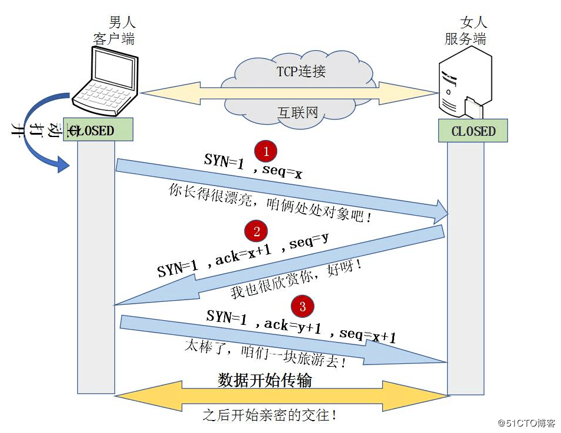
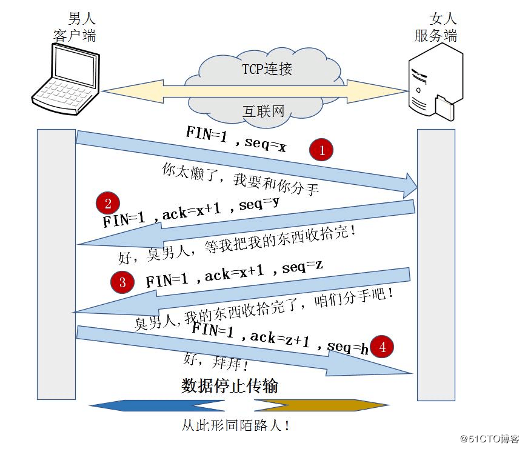

### redis    
**优点：**  

1 读写性能优异

2 支持数据持久化，支持AOF（以日志的形式记录服务器所处理的每一个写、删除操作，查询操作不会记录，以文本的方式记录，可以打开文件看到详细的操作记录）
和RDB（在指定的时间间隔内将内存中的数据集快照写入磁盘）两种持久化方式

3 支持主从复制，主机会自动将数据同步到从机，可以进行读写分离(让主数据库（master）处理事务性增、改、删操作（INSERT、UPDATE、DELETE），而从数据库（slave）处理SELECT查询操作。)。

4 数据结构丰富：除了支持string类型的value外还支持string、hash、set、sortedset、list等数据结构。

 
**缺点：**

1 Redis不具备自动容错和恢复功能，主机从机的宕机都会导致前端部分读写请求失败，需要等待机器重启或者手动切换前端的IP才能恢复。

2 主机宕机，宕机前有部分数据未能及时同步到从机，切换IP后还会引入数据不一致的问题，降低了系统的可用性。

3 Redis的主从复制采用全量复制，复制过程中主机会fork出一个子进程对内存做一份快照，并将子进程的内存快照保存为文件发送给从机，这一过程需要确保主机有足够多的空余内存。若快照文件较大，对集群的服务能力会产生较大的影响，而且复制过程是在从机新加入集群或者从机和主机网络断开重连时都会进行，也就是网络波动都会造成主机和从机间的一次全量的数据复制，这对实际的系统运营造成了不小的麻烦。

4 Redis较难支持在线扩容，在集群容量达到上限时在线扩容会变得很复杂。为避免这一问题，运维人员在系统上线时必须确保有足够的空间，这对资源造成了很大的浪费。

 

**1. 使用redis有哪些好处？**

(1) 速度快，因为数据存在内存中，类似于HashMap，HashMap的优势就是查找和操作的时间复杂度都是O(1)

(2) 支持丰富数据类型，支持string，list，set，sorted set，hash

(3) 支持事务，操作都是原子性，所谓的原子性就是对数据的更改要么全部执行，要么全部不执行

(4) 丰富的特性：可用于缓存，消息，按key设置过期时间，过期后将会自动删除

**2. redis相比memcached有哪些优势？**

(1) memcached所有的值均是简单的字符串，redis作为其替代者，支持更为丰富的数据类型

(2) redis的速度比memcached快很多

(3) redis可以持久化其数据

**3. redis常见性能问题和解决方案：**

(1) Master最好不要做任何持久化工作，如RDB内存快照和AOF日志文件

(2) 如果数据比较重要，某个Slave开启AOF备份数据，策略设置为每秒同步一次

(3) 为了主从复制的速度和连接的稳定性，Master和Slave最好在同一个局域网内

(4) 尽量避免在压力很大的主库上增加从库

(5) 主从复制不要用图状结构，用单向链表结构更为稳定，即：Master <- Slave1 <- Slave2 <- Slave3...

这样的结构方便解决单点故障问题，实现Slave对Master的替换。如果Master挂了，可以立刻启用Slave1做Master，其他不变。

### rabbitmq 
**1.什么是rabbitmq**  
采用AMQP高级消息队列协议的一种消息队列技术,最大的特点就是消费并不需要确保提供方存在,实现了服务之间的高度解耦

**2.为什么要使用rabbitmq**  
1.在分布式系统下具备异步,削峰,负载均衡等一系列高级功能;
2.拥有持久化的机制，进程消息，队列中的信息也可以保存下来。
3.实现消费者和生产者之间的解耦。
4.对于高并发场景下，利用消息队列可以使得同步访问变为串行访问达到一定量的限流，利于数据库的操作。
5.可以使用消息队列达到异步下单的效果，排队中，后台进行逻辑下单。

**3.使用rabbitmq的场景**  
1.服务间异步通信
2.顺序消费
3.定时任务
4.请求削峰

**4.如何确保消息正确地发送至RabbitMQ？ 如何确保消息接收方消费了消息？**  
发送方确认模式：
将信道设置成confirm模式（发送方确认模式），则所有在信道上发布的消息都会被指派一个唯一的ID。
一旦消息被投递到目的队列后，或者消息被写入磁盘后（可持久化的消息），信道会发送一个确认给生产者（包含消息唯一ID）。
如果RabbitMQ发生内部错误从而导致消息丢失，会发送一条nack（not acknowledged，未确认）消息。
发送方确认模式是异步的，生产者应用程序在等待确认的同时，可以继续发送消息。当确认消息到达生产者应用程序，生产者应用程序的回调方法就会被触发来处理确认消息。

**接收方确认机制**  
接收方消息确认机制：消费者接收每一条消息后都必须进行确认（消息接收和消息确认是两个不同操作）。只有消费者确认了消息，RabbitMQ才能安全地把消息从队列中删除。
这里并没有用到超时机制，RabbitMQ仅通过Consumer的连接中断来确认是否需要重新发送消息。也就是说，只要连接不中断，RabbitMQ给了Consumer足够长的时间来处理消息。保证数据的最终一致性；
下面罗列几种特殊情况：
如果消费者接收到消息，在确认之前断开了连接或取消订阅，RabbitMQ会认为消息没有被分发，然后重新分发给下一个订阅的消费者。（可能存在消息重复消费的隐患，需要去重）
如果消费者接收到消息却没有确认消息，连接也未断开，则RabbitMQ认为该消费者繁忙，将不会给该消费者分发更多的消息。

**5.如何避免消息重复投递或重复消费？**    
在消息生产时，MQ内部针对每条生产者发送的消息生成一个inner-msg-id，作为去重的依据（消息投递失败并重传），避免重复的消息进入队列；
在消息消费时，要求消息体中必须要有一个bizId（对于同一业务全局唯一，如支付ID、订单ID、帖子ID等）作为去重的依据，避免同一条消息被重复消费。   
**6.消息基于什么传输？**   
由于TCP连接的创建和销毁开销较大，且并发数受系统资源限制，会造成性能瓶颈。RabbitMQ使用信道的方式来传输数据。信道是建立在真实的TCP连接内的虚拟连接，且每条TCP连接上的信道数量没有限制。

**7.消息如何分发？**     
若该队列至少有一个消费者订阅，消息将以循环（round-robin）的方式发送给消费者。每条消息只会分发给一个订阅的消费者（前提是消费者能够正常处理消息并进行确认）。
通过路由可实现多消费的功能

**8.消息怎么路由？**    
消息提供方->路由->一至多个队列
消息发布到交换器时，消息将拥有一个路由键（routing key），在消息创建时设定。
通过队列路由键，可以把队列绑定到交换器上。
消息到达交换器后，RabbitMQ会将消息的路由键与队列的路由键进行匹配（针对不同的交换器有不同的路由规则）；
常用的交换器主要分为一下三种：
fanout：如果交换器收到消息，将会广播到所有绑定的队列上
direct：如果路由键完全匹配，消息就被投递到相应的队列
topic：可以使来自不同源头的消息能够到达同一个队列。 使用topic交换器时，可以使用通配符

**9.如何确保消息不丢失？**  
消息持久化，当然前提是队列必须持久化
RabbitMQ确保持久性消息能从服务器重启中恢复的方式是，将它们写入磁盘上的一个持久化日志文件，当发布一条持久性消息到持久交换器上时，Rabbit会在消息提交到日志文件后才发送响应。
一旦消费者从持久队列中消费了一条持久化消息，RabbitMQ会在持久化日志中把这条消息标记为等待垃圾收集。如果持久化消息在被消费之前RabbitMQ重启，那么Rabbit会自动重建交换器和队列（以及绑定），并重新发布持久化日志文件中的消息到合适的队列。

**10.使用RabbitMQ有什么好处？**  
服务间高度解耦，
异步通信性能高，
流量削峰
…

**11.rabbitmq的集群**  
镜像集群模式
你创建的queue，无论元数据还是queue里的消息都会存在于多个实例上，然后每次你写消息到queue的时候，都会自动把消息到多个实例的queue里进行消息同步。

好处在于，你任何一个机器宕机了，没事儿，别的机器都可以用。坏处在于，第一，这个性能开销也太大了吧，消息同步所有机器，导致网络带宽压力和消耗很重！第二，这么玩儿，就没有扩展性可言了，如果某个queue负载很重，你加机器，新增的机器也包含了这个queue的所有数据，并没有办法线性扩展你的queue

**12.mq的缺点**  
系统可用性降低
系统引入的外部依赖越多，越容易挂掉，本来你就是A系统调用BCD三个系统的接口就好了，人ABCD四个系统好好的，没啥问题，你偏加个MQ进来，万一MQ挂了咋整？MQ挂了，整套系统崩溃了，你不就完了么。

系统复杂性提高：
硬生生加个MQ进来，你怎么保证消息没有重复消费？怎么处理消息丢失的情况？怎么保证消息传递的顺序性？头大头大，问题一大堆，痛苦不已

**一致性问题：**  
A系统处理完了直接返回成功了，人都以为你这个请求就成功了；但是问题是，要是BCD三个系统那里，BD两个系统写库成功了，结果C系统写库失败了，咋整？你这数据就不一致了。
 
### 集合框架   

#### Arraylist 与 LinkedList 异同  
1. **是否保证线程安全：** ArrayList 和 LinkedList 都是不同步的，也就是不保证线程安全；
2. **底层数据结构：** Arraylist 底层使用的是Object数组；LinkedList 底层使用的是双向循环链表数据结构；
3. **插入和删除是否受元素位置的影响：** **① ArrayList 采用数组存储，所以插入和删除元素的时间复杂度受元素位置的影响。**比如：执行add(E e)方法的时候， ArrayList 会默认在将指定的元素追加到此列表的末尾，这种情况时间复杂度就是O(1)。但是如果要在指定位置 i 插入和删除元素的话（add(int index, E element)）时间复杂度就为 O(n-i)。因为在进行上述操作的时候集合中第 i 和第 i 个元素之后的(n-i)个元素都要执行向后位/向前移一位的操作。**② LinkedList 采用链表存储，所以插入，删除元素时间复杂度不受元素位置的影响，都是近似 O（1）而数组为近似 O（n）。**
4. **是否支持快速随机访问：** LinkedList 不支持高效的随机元素访问，而ArrayList 实现了RandmoAccess 接口，所以有随机访问功能。快速随机访问就是通过元素的序号快速获取元素对象(对应于get(int index)方法)。
5. **内存空间占用：** ArrayList的空 间浪费主要体现在在list列表的结尾会预留一定的容量空间，而LinkedList的空间花费则体现在它的每一个元素都需要消耗比ArrayList更多的空间（因为要存放直接后继和直接前驱以及数据）。
#### 补充：数据结构基础之双向链表
双向链表也叫双链表，是链表的一种，它的每个数据结点中都有两个指针，分别指向直接后继和直接前驱。所以，从双向链表中的任意一个结点开始，都可以很方便地访问它的前驱结点和后继结点。一般我们都构造双向循环链表，如下图所示，同时下图也是LinkedList 底层使用的是双向循环链表数据结构。

#### ArrayList 与 Vector 区别
Vector类的所有方法都是同步的。可以由两个线程安全地访问一个Vector对象、但是一个线程访问Vector的话代码要在同步操作上耗费大量的时间。

Arraylist不是同步的，所以在不需要保证线程安全时时建议使用Arraylist。

#### HashMap的底层实现
JDK1.8之前
JDK1.8 之前 HashMap 由**数组+链表** 组成的（**“链表散列”** 即数组和链表的结合体），数组是 HashMap 的主体，链表则是主要为了解决哈希冲突而存在的（HashMap 采用 **“拉链法也就是链地址法”**解决冲突），如果定位到的数组位置不含链表（当前 entry 的 next 指向 null ）,那么对于查找，添加等操作很快，仅需一次寻址即可；如果定位到的数组包含链表，对于添加操作，其时间复杂度依然为 O(1)，因为最新的 Entry 会插入链表头部，急需要简单改变引用链即可，而对于查找操作来讲，此时就需要遍历链表，然后通过 key 对象的 equals 方法逐一比对查找.

*所谓 “拉链法” 就是将链表和数组相结合。也就是说创建一个链表数组，数组中每一格就是一个链表。若遇到哈希冲突，则将冲突的值加到链表中即可。
JDK1.8之后
相比于之前的版本， JDK1.8之后在解决哈希冲突时有了较大的变化，当链表长度大于阈值（默认为8）时，将链表转化为红黑树，以减少搜索时间。*

TreeMap、TreeSet以及JDK1.8之后的HashMap底层都用到了红黑树。红黑树就是为了解决二叉查找树的缺陷，因为二叉查找树在某些情况下会退化成一个线性结构。
推荐阅读：

《Java 8系列之重新认识HashMap》 ：https://zhuanlan.zhihu.com/p/21673805
#### HashMap 和 Hashtable 的区别
**1.线程是否安全：**
 HashMap 是非线程安全的，HashTable 是线程安全的；HashTable 内部的方法基本都经过 synchronized 修饰。（如果你要保证线程安全的话就使用 ConcurrentHashMap 吧！）；
**效率：**
 因为线程安全的问题，HashMap 要比 HashTable 效率高一点。另外，HashTable 基本被淘汰，不要在代码中使用它；
**对Null key 和Null value的支持：**
 HashMap 中，null 可以作为键，这样的键只有一个，可以有一个或多个键所对应的值为 null。。但是在 HashTable 中 put 进的键值只要有一个 null，直接抛出 NullPointerException。
**初始容量大小和每次扩充容量大小的不同 ：**
 ①创建时如果不指定容量初始值，Hashtable 默认的初始大小为11，之后每次扩充，容量变为原来的2n+1。HashMap 默认的初始化大小为16。之后每次扩充，容量变为原来的2倍。②创建时如果给定了容量初始值，那么 Hashtable 会直接使用你给定的大小，而 HashMap 会将其扩充为2的幂次方大小。也就是说 HashMap 总是使用2的幂作为哈希表的大小,后面会介绍到为什么是2的幂次方。
**底层数据结构：** 
JDK1.8 以后的 HashMap 在解决哈希冲突时有了较大的变化，当链表长度大于阈值（默认为8）时，将链表转化为红黑树，以减少搜索时间。Hashtable 没有这样的机制。
#### HashMap 的长度为什么是2的幂次方

为了能让 HashMap 存取高效，尽量较少碰撞，也就是要尽量把数据分配均匀，每个链表/红黑树长度大致相同。这个实现就是把数据存到哪个链表/红黑树中的算法。

这个算法应该如何设计呢？

我们首先可能会想到采用%取余的操作来实现。但是，重点来了：“取余(%)操作中如果除数是2的幂次则等价于与其除数减一的与(&)操作（也就是说 hash%length==hash&(length-1)的前提是 length 是2的 n 次方；）。” 并且 采用二进制位操作 &，相对于%能够提高运算效率，这就解释了 HashMap 的长度为什么是2的幂次方。

#### HashSet 和 HashMap 区别

##### ConcurrentHashMap 和 Hashtable 的区别
ConcurrentHashMap 和 Hashtable 的区别主要体现在实现线程安全的方式上不同。

**1.底层数据结构：** 
JDK1.7的 ConcurrentHashMap 底层采用 分段的数组+链表 实现，JDK1.8 采用的数据结构跟HashMap1.8的结构一样，数组+链表/红黑二叉树。Hashtable 和 JDK1.8 之前的 HashMap 的底层数据结构类似都是采用 数组+链表 的形式，数组是 HashMap 的主体，链表则是主要为了解决哈希冲突而存在的；
**2.实现线程安全的方式（重要）：**  
**① 在JDK1.7的时候，ConcurrentHashMap（分段锁）** 对整个桶数组进行了分割分段(Segment)，每一把锁只锁容器其中一部分数据，多线程访问容器里不同数据段的数据，就不会存在锁竞争，提高并发访问率。（默认分配16个Segment，比Hashtable效率提高16倍。） **到了 JDK1.8 的时候已经摒弃了Segment的概念，而是直接用 Node 数组+链表+红黑树的数据结构来实现，并发控制使用 synchronized 和 CAS 来操作。（JDK1.6以后 对 synchronized锁做了很多优化）** 整个看起来就像是优化过且线程安全的 HashMap，虽然在JDK1.8中还能看到 Segment 的数据结构，但是已经简化了属性，只是为了兼容旧版本；**② Hashtable(同一把锁):** 使用 synchronized 来保证线程安全，效率非常低下。当一个线程访问同步方法时，其他线程也访问同步方法，可能会进入阻塞或轮询状态，如使用 put 添加元素，另一个线程不能使用 put 添加元素，也不能使用 get，竞争会越来越激烈效率越低。
两者的对比图：

图片来源：http://www.cnblogs.com/chengxiao/p/6842045.html

HashTable:

JDK1.7的ConcurrentHashMap：

JDK1.8的ConcurrentHashMap（TreeBin: 红黑二叉树节点 Node: 链表节点）：

#### ConcurrentHashMap线程安全的具体实现方式/底层具体实现
#### JDK1.7（上面有示意图）
首先将数据分为一段一段的存储，然后给每一段数据配一把锁，当一个线程占用锁访问其中一个段数据时，其他段的数据也能被其他线程访问。

**ConcurrentHashMap 是由 Segment 数组结构和 HahEntry 数组结构组成。**

Segment 实现了 ReentrantLock,所以 Segment 是一种可重入锁，扮演锁的角色。HashEntry 用于存储键值对数据。

static class Segment<K,V> extends ReentrantLock implements Serializable {
}
一个 ConcurrentHashMap 里包含一个 Segment 数组。Segment 的结构和HashMap类似，是一种数组和链表结构，一个 Segment 包含一个 HashEntry 数组，每个 HashEntry 是一个链表结构的元素，每个 Segment 守护着一个HashEntry数组里的元素，当对 HashEntry 数组的数据进行修改时，必须首先获得对应的 Segment的锁。

**JDK1.8 （上面有示意图）**
ConcurrentHashMap取消了Segment分段锁，采用CAS和synchronized来保证并发安全。数据结构跟HashMap1.8的结构类似，数组+链表/红黑二叉树。

synchronized只锁定当前链表或红黑二叉树的首节点，这样只要hash不冲突，就不会产生并发，效率又提升N倍。

#### 集合框架底层数据结构总结
**一：Collection**
**1. List**
**Arraylist：** Object数组
**Vector：** Object数组
**LinkedList：** 双向循环链表
**2. Set**
**HashSet（无序，唯一）: **基于 HashMap 实现的，底层采用 HashMap 来保存元素
**LinkedHashSet：** LinkedHashSet 继承与 HashSet，并且其内部是通过 LinkedHashMap 来实现的。有点类似于我们之前说的LinkedHashMap 其内部是基于 Hashmap 实现一样，不过还是有一点点区别的。
**TreeSet（有序，唯一）：** 红黑树(自平衡的排序二叉树。)
#### 二：Map
**HashMap：** JDK1.8之前HashMap由数组+链表组成的，数组是HashMap的主体，链表则是主要为了解决哈希冲突而存在的（“拉链法”解决冲突）.JDK1.8以后在解决哈希冲突时有了较大的变化，当链表长度大于阈值（默认为8）时，将链表转化为红黑树，以减少搜索时间
**LinkedHashMap:** LinkedHashMap 继承自 HashMap，所以它的底层仍然是基于拉链式散列结构即由数组和链表或红黑树组成。另外，LinkedHashMap 在上面结构的基础上，增加了一条双向链表，使得上面的结构可以保持键值对的插入顺序。同时通过对链表进行相应的操作，实现了访问顺序相关逻辑。详细可以查看：《LinkedHashMap 源码详细分析（JDK1.8）》
**HashTable:** 数组+链表组成的，数组是 HashMap 的主体，链表则是主要为了解决哈希冲突而存在的
**TreeMap:** 红黑树（自平衡的排序二叉树）

 
### Linux20个常用命令

1.查找文件 
find / -name filename.txt 
根据名称查找/目录下的filename.txt文件。

2.查看一个程序是否运行 
ps –ef|grep tomcat 
查看所有有关tomcat的进程

3.终止线程 
kill -9 19979 
终止线程号位19979的线程

4.查看文件，包含隐藏文件 
ls -al

5.当前工作目录 
pwd

6.复制文件包括其子文件到自定目录 
cp -r sourceFolder targetFolder

7.创建目录 
mkdir newfolder

8.删除目录（此目录是空目录） 
rmdir deleteEmptyFolder

9.删除文件包括其子文件 
rm -rf deleteFile

10.移动文件 
mv /temp/movefile /targetFolder

扩展重命名 mv oldNameFile newNameFile

11.切换用户 
su -username

12.修改文件权限 
chmod 777 file.java 
//file.java的权限-rwxrwxrwx，r表示读、w表示写、x表示可执行

13.压缩文件 
tar -czf test.tar.gz /test1 /test2

14.列出压缩文件列表 
tar -tzf test.tar.gz

15.解压文件 
tar -xvzf test.tar.gz

16.查看文件头10行 
head -n 10 example.txt

17.查看文件尾10行 
tail -n 10 example.txt

18.查看日志文件 
tail -f exmaple.log 
//这个命令会自动显示新增内容，屏幕只显示10行内容的（可设置）。

19.启动Vi编辑器 
vi 
20.查看系统当前时间 
date 
命令会输出 周几 几月 几日 时间 和 时间显示格式 和年份 
Sat Jan 20 04:39:49 CST 2018 
date +”%Y-%m-%d” 
 

### TCP的三次握手和四次挥手
**三次握手过程说明：**   
    
    
1、由客户端发送建立TCP连接的请求报文，其中报文中包含seq序列号，是由发送端随机生成的，并且将报文中的SYN字段置为1，表示需要建立TCP连接。（SYN=1，seq=x，x为随机生成数值）   
2、由服务端回复客户端发送的TCP连接请求报文，其中包含seq序列号，是由回复端随机生成的，并且将SYN置为1，而且会产生ACK字段，ACK字段数值是在客户端发送过来的序列号seq的基础上加1进行回复，以便客户端收到信息时，知晓自己的TCP建立请求已得到验证。（SYN=1，ACK=x+1，seq=y，y为随机生成数值）这里的ack加1可以理解为是确认和谁建立连接。  
3、客户端收到服务端发送的TCP建立验证请求后，会使自己的序列号加1表示，并且再次回复ACK验证请求，在服务端发过来的seq上加1进行回复。（SYN=1，ACK=y+1，seq=x+1）

**四次挥手过程说明：**      

   

1、客户端发送断开TCP连接请求的报文，其中报文中包含seq序列号，是由发送端随机生成的，并且还将报文中的FIN字段置为1，表示需要断开TCP连接。（FIN=1，seq=x，x由客户端随机生成）   
2、服务端会回复客户端发送的TCP断开请求报文，其包含seq序列号，是由回复端随机生成的，而且会产生ACK字段，ACK字段数值是在客户端发过来的seq序列号基础上加1进行回复，以便客户端收到信息时，知晓自己的TCP断开请求已经得到验证。（FIN=1，ACK=x+1，seq=y，y由服务端随机生成）   
3、服务端在回复完客户端的TCP断开请求后，不会马上进行TCP连接的断开，服务端会先确保断开前，所有传输到A的数据是否已经传输完毕，一旦确认传输数据完毕，就会将回复报文的FIN字段置1，并且产生随机seq序列号。（FIN=1，ACK=x+1，seq=z，z由服务端随机生成）   
4、客户端收到服务端的TCP断开请求后，会回复服务端的断开请求，包含随机生成的seq字段和ACK字段，ACK字段会在服务端的TCP断开请求的seq基础上加1，从而完成服务端请求的验证回复。（FIN=1，ACK=z+1，seq=h，h为客户端随机生成） 
至此TCP断开的4次挥手过程完毕

### MySQL常见面试题
#### 1. 主键 超键 候选键 外键
**主 键：** 数据库表中对储存数据对象予以唯一和完整标识的数据列或属性的组合。一个数据列只能有一个主键，且主键的取值不能缺失，即不能为空值（Null）。  
**超 键：** 在关系中能唯一标识元组的属性集称为关系模式的超键。一个属性可以为作为一个超键，多个属性组合在一起也可以作为一个超键。超键包含候选键和主键。   
**候选键：** 是最小超键，即没有冗余元素的超键。  
**外 键：** 在一个表中存在的另一个表的主键称此表的外键。

#### 2.数据库事务的四个特性及含义
数据库事务transanction正确执行的四个基本要素。ACID,原子性(Atomicity)、一致性(Correspondence)、隔离性(Isolation)、持久性(Durability)。

**原子性:** 整个事务中的所有操作，要么全部完成，要么全部不完成，不可能停滞在中间某个环节。事务在执行过程中发生错误，会被回滚（Rollback）到事务开始的状态，就像这个事务从来没有执行过一样。  
**一致性:** 在事务开始之前和事务结束以后，数据库的完整性约束没有被破坏。  
**隔离性:** 隔离状态执行事务，使它们好像是系统在给定时间内执行的唯一操作。如果有两个事务，运行在相同的时间内，执行 相同的功能，事务的隔离性将确保每一事务在系统中认为只有该事务在使用系统。这种属性有时称为串行化，为了防止事务操作间的混淆，必须串行化或序列化请 求，使得在同一时间仅有一个请求用于同一数据。   
**持久性:** 在事务完成以后，该事务所对数据库所作的更改便持久的保存在数据库之中，并不会被回滚。

#### 3.视图的作用，视图可以更改么？
视图是虚拟的表，与包含数据的表不一样，视图只包含使用时动态检索数据的查询；不包含任何列或数据。使用视图可以简化复杂的sql操作，隐藏具体的细节，保护数据；视图创建后，可以使用与表相同的方式利用它们。
视图不能被索引，也不能有关联的触发器或默认值，如果视图本身内有order by 则对视图再次order by将被覆盖。
创建视图：create view XXX as XXXXXXXXXXXXXX;
对于某些视图比如未使用联结子查询分组聚集函数Distinct Union等，是可以对其更新的，对视图的更新将对基表进行更新；但是视图主要用于简化检索，保护数据，并不用于更新，而且大部分视图都不可以更新。

#### 4.drop,delete与truncate的区别
drop直接删掉表 truncate删除表中数据，再插入时自增长id又从1开始 delete删除表中数据，可以加where字句。

（1） DELETE语句执行删除的过程是每次从表中删除一行，并且同时将该行的删除操作作为事务记录在日志中保存以便进行进行回滚操作。TRUNCATE TABLE 则一次性地从表中删除所有的数据并不把单独的删除操作记录记入日志保存，删除行是不能恢复的。并且在删除的过程中不会激活与表有关的删除触发器。执行速度快。

（2） 表和索引所占空间。当表被TRUNCATE 后，这个表和索引所占用的空间会恢复到初始大小，而DELETE操作不会减少表或索引所占用的空间。drop语句将表所占用的空间全释放掉。

（3） 一般而言，drop > truncate > delete

（4） 应用范围。TRUNCATE 只能对TABLE；DELETE可以是table和view

（5） TRUNCATE 和DELETE只删除数据，而DROP则删除整个表（结构和数据）。

（6） truncate与不带where的delete ：只删除数据，而不删除表的结构（定义）drop语句将删除表的结构被依赖的约束（constrain),触发器（trigger)索引（index);依赖于该表的存储过程/函数将被保留，但其状态会变为：invalid。

（7） delete语句为DML（data maintain Language),这个操作会被放到 rollback segment中,事务提交后才生效。如果有相应的 tigger,执行的时候将被触发。

（8） truncate、drop是DLL（data define language),操作立即生效，原数据不放到 rollback segment中，不能回滚

（9） 在没有备份情况下，谨慎使用 drop 与 truncate。要删除部分数据行采用delete且注意结合where来约束影响范围。回滚段要足够大。要删除表用drop;若想保留表而将表中数据删除，如果于事务无关，用truncate即可实现。如果和事务有关，或老师想触发trigger,还是用delete。

（10） Truncate table 表名 速度快,而且效率高,因为:
truncate table 在功能上与不带 WHERE 子句的 DELETE 语句相同：二者均删除表中的全部行。但 TRUNCATE TABLE 比 DELETE 速度快，且使用的系统和事务日志资源少。DELETE 语句每次删除一行，并在事务日志中为所删除的每行记录一项。TRUNCATE TABLE 通过释放存储表数据所用的数据页来删除数据，并且只在事务日志中记录页的释放。

（11） TRUNCATE TABLE 删除表中的所有行，但表结构及其列、约束、索引等保持不变。新行标识所用的计数值重置为该列的种子。如果想保留标识计数值，请改用 DELETE。如果要删除表定义及其数据，请使用 DROP TABLE 语句。

（12） 对于由 FOREIGN KEY 约束引用的表，不能使用 TRUNCATE TABLE，而应使用不带 WHERE 子句的 DELETE 语句。由于 TRUNCATE TABLE 不记录在日志中，所以它不能激活触发器。

#### 5.索引的工作原理及其种类
**数据库索引，** 是数据库管理系统中一个排序的数据结构，以协助快速查询、更新数据库表中数据。**索引的实现通常使用B树及其变种B+树。**

在数据之外，数据库系统还维护着满足特定查找算法的数据结构，这些数据结构以某种方式引用（指向）数据，这样就可以在这些数据结构上实现高级查找算法。这种数据结构，就是索引。

为表设置索引要付出代价的：一是增加了数据库的存储空间，二是在插入和修改数据时要花费较多的时间(因为索引也要随之变动)。

图展示了一种可能的索引方式。左边是数据表，一共有两列七条记录，最左边的是数据记录的物理地址（注意逻辑上相邻的记录在磁盘上也并不是一定物理相邻的）。为了加快Col2的查找，可以维护一个右边所示的二叉查找树，每个节点分别包含索引键值和一个指向对应数据记录物理地址的指针，这样就可以运用二叉查找在O(log2n)的复杂度内获取到相应数据。

创建索引可以大大提高系统的性能。

第一，通过创建唯一性索引，可以保证数据库表中每一行数据的唯一性。

第二，可以大大加快数据的检索速度，这也是创建索引的最主要的原因。

第三，可以加速表和表之间的连接，特别是在实现数据的参考完整性方面特别有意义。

第四，在使用分组和排序子句进行数据检索时，同样可以显著减少查询中分组和排序的时间。

第五，通过使用索引，可以在查询的过程中，使用优化隐藏器，提高系统的性能。

也许会有人要问：增加索引有如此多的优点，为什么不对表中的每一个列创建一个索引呢？因为，增加索引也有许多不利的方面。

第一，创建索引和维护索引要耗费时间，这种时间随着数据量的增加而增加。

第二，索引需要占物理空间，除了数据表占数据空间之外，每一个索引还要占一定的物理空间，如果要建立聚簇索引，那么需要的空间就会更大。

第三，当对表中的数据进行增加、删除和修改的时候，索引也要动态的维护，这样就降低了数据的维护速度。

索引是建立在数据库表中的某些列的上面。在创建索引的时候，应该考虑在哪些列上可以创建索引，在哪些列上不能创建索引。一般来说，应该在这些列上创建索引：在经常需要搜索的列上，可以加快搜索的速度；在作为主键的列上，强制该列的唯一性和组织表中数据的排列结构；在经常用在连接的列上，这些列主要是一些外键，可以加快连接的速度；在经常需要根据范围进行搜索的列上创建索引，因为索引已经排序，其指定的范围是连续的；在经常需要排序的列上创建索引，因为索引已经排序，这样查询可以利用索引的排序，加快排序查询时间；在经常使用在WHERE子句中的列上面创建索引，加快条件的判断速度。

同样，对于有些列不应该创建索引。一般来说，不应该创建索引的的这些列具有下列特点：

第一，对于那些在查询中很少使用或者参考的列不应该创建索引。这是因为，既然这些列很少使用到，因此有索引或者无索引，并不能提高查询速度。相反，由于增加了索引，反而降低了系统的维护速度和增大了空间需求。

第二，对于那些只有很少数据值的列也不应该增加索引。这是因为，由于这些列的取值很少，例如人事表的性别列，在查询的结果中，结果集的数据行占了表中数据行的很大比例，即需要在表中搜索的数据行的比例很大。增加索引，并不能明显加快检索速度。

第三，对于那些定义为text, image和bit数据类型的列不应该增加索引。这是因为，这些列的数据量要么相当大，要么取值很少。

第四，当修改性能远远大于检索性能时，不应该创建索引。这是因为，修改性能和检索性能是互相矛盾的。当增加索引时，会提高检索性能，但是会降低修改性能。当减少索引时，会提高修改性能，降低检索性能。因此，当修改性能远远大于检索性能时，不应该创建索引。

根据数据库的功能，可以在数据库设计器中创建三种索引：唯一索引、主键索引和聚集索引。

**唯一索引**唯一索引是不允许其中任何两行具有相同索引值的索引。当现有数据中存在重复的键值时，大多数数据库不允许将新创建的唯一索引与表一起保存。数据库还可能防止添加将在表中创建重复键值的新数据。例如，如果在employee表中职员的姓(lname)上创建了唯一索引，则任何两个员工都不能同姓。 
**主键索引**数据库表经常有一列或列组合，其值唯一标识表中的每一行。该列称为表的主键。 在数据库关系图中为表定义主键将自动创建主键索引，主键索引是唯一索引的特定类型。该索引要求主键中的每个值都唯一。当在查询中使用主键索引时，它还允许对数据的快速访问。
**聚集索引** 在聚集索引中，表中行的物理顺序与键值的逻辑（索引）顺序相同。一个表只能包含一个聚集索引。

如果某索引不是聚集索引，则表中行的物理顺序与键值的逻辑顺序不匹配。**与非聚集索引相比，聚集索引通常提供更快的数据访问速度。**

#### 局部性原理与磁盘预读
由于存储介质的特性，磁盘本身存取就比主存慢很多，再加上机械运动耗费，磁盘的存取速度往往是主存的几百分分之一，因此为了提高效率，要尽量减少磁盘I/O。为了达到这个目的，磁盘往往不是严格按需读取，而是每次都会预读，即使只需要一个字节，磁盘也会从这个位置开始，顺序向后读取一定长度的数据放入内存。这样做的理论依据是计算机科学中著名的**局部性原理：当一个数据被用到时，其附近的数据也通常会马上被使用。程序运行期间所需要的数据通常比较集中。**

由于磁盘顺序读取的效率很高（不需要寻道时间，只需很少的旋转时间），因此对于具有局部性的程序来说，预读可以提高I/O效率。

预读的长度一般为页（page）的整倍数。页是计算机管理存储器的逻辑块，硬件及操作系统往往将主存和磁盘存储区分割为连续的大小相等的块，每个存储块称为一页（在许多操作系统中，页得大小通常为4k），主存和磁盘以页为单位交换数据。当程序要读取的数据不在主存中时，会触发一个缺页异常，此时系统会向磁盘发出读盘信号，磁盘会找到数据的起始位置并向后连续读取一页或几页载入内存中，然后异常返回，程序继续运行。

#### B-/+Tree索引的性能分析
到这里终于可以分析B-/+Tree索引的性能了。

上文说过一般使用磁盘I/O次数评价索引结构的优劣。先从B-Tree分析，根据B-Tree的定义，可知检索一次最多需要访问h个节点。数据库系统的设计者巧妙利用了磁盘预读原理，将一个节点的大小设为等于一个页，这样每个节点只需要一次I/O就可以完全载入。为了达到这个目的，在实际实现B-Tree还需要使用如下技巧：

每次新建节点时，直接申请一个页的空间，这样就保证一个节点物理上也存储在一个页里，加之计算机存储分配都是按页对齐的，就实现了一个node只需一次I/O。

**B-Tree中一次检索最多需要h-1次I/O（根节点常驻内存），渐进复杂度为O(h)=O(logdN)。**一般实际应用中，出度d是非常大的数字，通常超过100，因此h非常小（通常不超过3）。

而红黑树这种结构，h明显要深的多。由于逻辑上很近的节点（父子）物理上可能很远，无法利用局部性，所以红黑树的I/O渐进复杂度也为O(h)，效率明显比B-Tree差很多。

**综上所述，用B-Tree作为索引结构效率是非常高的。**

### 6.连接的种类
查询分析器中执行：
建表table1,table2：
create table table1(id int,name varchar(10))
create table table2(id int,score int)
insert into table1 select 1,'lee'
insert into table1 select 2,'zhang'
insert into table1 select 4,'wang'
insert into table2 select 1,90
insert into table2 select 2,100
insert into table2 select 3,70
如表

table1 | table2 |

id name |id score |
1 lee |1 90|
2 zhang| 2 100|
4 wang| 3 70|

以下均在查询分析器中执行
一、外连接
1.概念：包括左向外联接、右向外联接或完整外部联接

2.左连接：left join 或 left outer join
(1)左向外联接的结果集包括 LEFT OUTER 子句中指定的左表的所有行，而不仅仅是联接列所匹配的行。如果左表的某行在右表中没有匹配行，则在相关联的结果集行中右表的所有选择列表列均为空值(null)。
(2)sql 语句
select * from table1 left join table2 on table1.id=table2.id

idnameidscore

1lee190
2zhang2100
4wangNULLNULL

注释：包含table1的所有子句，根据指定条件返回table2相应的字段，不符合的以null显示

3.右连接：right join 或 right outer join
(1)右向外联接是左向外联接的反向联接。将返回右表的所有行。如果右表的某行在左表中没有匹配行，则将为左表返回空值。
(2)sql 语句
select * from table1 right join table2 on table1.id=table2.id
结果:
idnameidscore

1lee190
2zhang2100
NULLNULL370

注释：包含table2的所有子句，根据指定条件返回table1相应的字段，不符合的以null显示

4.完整外部联接:full join 或 full outer join
(1)完整外部联接返回左表和右表中的所有行。当某行在另一个表中没有匹配行时，则另一个表的选择列表列包含空值。如果表之间有匹配行，则整个结果集行包含基表的数据值。
(2)sql 语句
select * from table1 full join table2 on table1.id=table2.id
 结果:
idnameidscore
 
1lee190
2zhang2100
4wangNULLNULL
NULLNULL370
 
注释：返回左右连接的和（见上左、右连接）

二、内连接
1.概念：内联接是用比较运算符比较要联接列的值的联接

2.内连接：join 或 inner join

3.sql 语句
select * from table1 join table2 on table1.id=table2.id
 结果:
idnameidscore

1lee190
2zhang2100

注释：只返回符合条件的table1和table2的列

4.等价（与下列执行效果相同）
A:select a.*,b.* from table1 a,table2 b where a.id=b.id
B:select * from table1 cross join table2 where table1.id=table2.id (注：cross join后加条件只能用where,不能用on)

三、交叉连接(完全)

1.概念：没有 WHERE 子句的交叉联接将产生联接所涉及的表的笛卡尔积。第一个表的行数乘以第二个表的行数等于笛卡尔积结果集的大小。（table1和table2交叉连接产生3*3=9条记录）

2.交叉连接：cross join (不带条件where...)

3.sql语句
select * from table1 cross join table2
结果:
idnameidscore

1lee190
2zhang190
4wang190
1lee2100
2zhang2100
4wang2100
1lee370
2zhang370
4wang370

注释：返回3*3=9条记录，即笛卡尔积

4.等价（与下列执行效果相同）
A:select * from table1,table2

#### 7.数据库范式
**1 第一范式（1NF）**

在任何一个关系数据库中，第一范式（1NF）是对关系模式的基本要求，不满足第一范式（1NF）的数据库就不是关系数据库。
所谓第一范式（1NF）是指数据库表的每一列都是不可分割的基本数据项，同一列中不能有多个值，即实体中的某个属性不能有多个值或者不能有重复的属性。如果出现重复的属性，就可能需要定义一个新的实体，新的实体由重复的属性构成，新实体与原实体之间为一对多关系。在第一范式（1NF）中表的每一行只包含一个实例的信息。简而言之，第一范式就是无重复的列。

**2 第二范式（2NF）**

第二范式（2NF）是在第一范式（1NF）的基础上建立起来的，即满足第二范式（2NF）必须先满足第一范式（1NF）。第二范式（2NF）要求数据库表中的每个实例或行必须可以被惟一地区分。为实现区分通常需要为表加上一个列，以存储各个实例的惟一标识。这个惟一属性列被称为主关键字或主键、主码。
第二范式（2NF）要求实体的属性完全依赖于主关键字。所谓完全依赖是指不能存在仅依赖主关键字一部分的属性，如果存在，那么这个属性和主关键字的这一部分应该分离出来形成一个新的实体，新实体与原实体之间是一对多的关系。为实现区分通常需要为表加上一个列，以存储各个实例的惟一标识。简而言之，第二范式就是非主属性非部分依赖于主关键字。

**3 第三范式（3NF）**

满足第三范式（3NF）必须先满足第二范式（2NF）。简而言之，第三范式（3NF）要求一个数据库表中不包含已在其它表中已包含的非主关键字信息。例如，存在一个部门信息表，其中每个部门有部门编号（dept_id）、部门名称、部门简介等信息。那么在员工信息表中列出部门编号后就不能再将部门名称、部门简介等与部门有关的信息再加入员工信息表中。如果不存在部门信息表，则根据第三范式（3NF）也应该构建它，否则就会有大量的数据冗余。简而言之，第三范式就是属性不依赖于其它非主属性。（我的理解是消除冗余）

#### 8.数据库优化的思路
这个我借鉴了慕课上关于数据库优化的课程。

**1.SQL语句优化**
1）应尽量避免在 where 子句中使用!=或<>操作符，否则将引擎放弃使用索引而进行全表扫描。
2）应尽量避免在 where 子句中对字段进行 null 值判断，否则将导致引擎放弃使用索引而进行全表扫描，如：
select id from t where num is null
**可以在num上设置默认值0，确保表中num列没有null值，**然后这样查询：
select id from t where num=0
3）很多时候用 exists 代替 in 是一个好的选择
4）用Where子句替换HAVING 子句 因为HAVING 只会在检索出所有记录之后才对结果集进行过滤

**2.索引优化**   
看上文索引

**3.数据库结构优化**   
1）范式优化： 比如消除冗余（节省空间。。）   
2）反范式优化：比如适当加冗余等（减少join）   
3）拆分表： 分区将数据在物理上分隔开，不同分区的数据可以制定保存在处于不同磁盘上的数据文件里。这样，当对这个表进行查询时，只需要在表分区中进行扫描，而不必进行全表扫描，明显缩短了查询时间，另外处于不同磁盘的分区也将对这个表的数据传输分散在不同的磁盘I/O，一个精心设置的分区可以将数据传输对磁盘I/O竞争均匀地分散开。对数据量大的时时表可采取此方法。可按月自动建表分区。   
4）拆分其实又分垂直拆分和水平拆分： 案例： 简单购物系统暂设涉及如下表： 1.产品表（数据量10w，稳定） 2.订单表（数据量200w，且有增长趋势） 3.用户表 （数据量100w，且有增长趋势） 以mysql为例讲述下水平拆分和垂直拆分，mysql能容忍的数量级在百万静态数据可以到千万 垂直拆分：解决问题：表与表之间的io竞争 不解决问题：单表中数据量增长出现的压力 方案： 把产品表和用户表放到一个server上 订单表单独放到一个server上 水平拆分： 解决问题：单表中数据量增长出现的压力 不解决问题：表与表之间的io争夺  
方案： 用户表通过性别拆分为男用户表和女用户表 订单表通过已完成和完成中拆分为已完成订单和未完成订单 产品表 未完成订单放一个server上 已完成订单表盒男用户表放一个server上 女用户表放一个server上(女的爱购物 哈哈)

**4.服务器硬件优化**   
这个么多花钱咯！
#### 9.存储过程与触发器的区别   
触发器与存储过程非常相似，触发器也是SQL语句集，两者唯一的区别是触发器不能用EXECUTE语句调用，而是在用户执行Transact-SQL语句时自动触发（激活）执行。触发器是在一个修改了指定表中的数据时执行的存储过程。通常通过创建触发器来强制实现不同表中的逻辑相关数据的引用完整性和一致性。由于用户不能绕过触发器，所以可以用它来强制实施复杂的业务规则，以确保数据的完整性。触发器不同于存储过程，触发器主要是通过事件执行触发而被执行的，而存储过程可以通过存储过程名称名字而直接调用。当对某一表进行诸如UPDATE、INSERT、DELETE这些操作时，SQLSERVER就会自动执行触发器所定义的SQL语句，从而确保对数据的处理必须符合这些SQL语句所定义的规则。

### Java设计模式
总体来说设计模式分为三大类：   
**创建型模式，共五种：**工厂方法模式、抽象工厂模式、单例模式、建造者模式、原型模式。   
**结构型模式，共七种：**适配器模式、装饰器模式、代理模式、外观模式、桥接模式、组合模式、享元模式。   
**行为型模式，共十一种：** 策略模式、模板方法模式、观察者模式、迭代子模式、责任链模式、命令模式、备忘录模式、状态模式、访问者模式、中介者模式、解释器模式。   
**1.请列举出在JDK中几个常用的设计模式？**   
单例模式用于Runtime, Calendar和其他的一些类中。工厂模式被用于各种不可变的类如Boolean，像Boolean.valueOf方法。观察者模式被用于swing和很多的时间监听中。装饰器模式被用于多个java IO类。   
**2.什么是设计模式？你是否在你的代码里面使用过任何设计模式？**   
设计模式是世界上各种各样程序员用来解决特定设计问题的尝试和测试的方法。设计模式是代码可用性的延伸。
**3.Java 中什么叫单例设计模式？请用Java 写出线程安全的单例模式**   

**4.解释下什么是观察者模式？**   
观察者模式是基于对象的状态变化和观察者的通讯，以便他们作出相应的操作。简单的例子就是一个天气系统，当天气变化时必须在展示给公众的视图中进行反映。这个视图对象是一个主体，而不同的视图是观察者。   
**5.使用工厂模式最主要的好处是什么？在哪里使用？**   
工厂模式的最大好处是增加了创建对象时的封装层次。如果你使用工厂来创建对象，之后你可以使用更高级和更高性能的实现来替换原始的产品实现或类，这不需要在调用层做任何修改。  
**6.举一个用Java 实现的装饰模式(decorator design pattern)？它是作用于对象层次还是类层次？**  
装饰模式增加强了单个对象的能力。Java IO 到处都使用了装饰模式，典型例子就是Buffered 系列类如BufferedReader和BufferedWriter，它们增强了Reader和Writer对象，以实现提升性能的 Buffer 层次的读取和写入。

**7.设计一个ATM 机，请说出你的设计思路。**   
比如设计金融系统来说，必须知道它们应该在任何情况下都能够正常工作。不管是断电还是其他情况，ATM 应该保持正确的状态（事务） , 想想加锁（locking）、事务（transaction）、错误条件（error condition）、边界条件（boundary condition）等等。尽管你不能想到具体的设计，但如果你可以指出非功能性需求，提出一些问题，想到关于边界条件，这些都会是很好的。   
**8.在Java 中，什么时候用重载，什么时候用重写？**  
如果你看到一个类的不同实现有着不同的方式来做同一件事，那么就应该用重写（overriding），而重载（overloading）是用不同的输入做同一件事。在Java 中，重载的方法签名不同，而重写并不是。   
**9.举例说明什么情况下会更倾向于使用抽象类而不是接口？**   
接口和抽象类都遵循”面向接口而不是实现编码”设计原则，它可以增加代码的灵活性，可以适应不断变化的需求。下面有几个点可以帮助你回答这个问题：

在 Java 中，你只能继承一个类，但可以实现多个接口。所以一旦你继承了一个类，你就失去了继承其他类的机会了。接口通常被用来表示附属描述或行为如：Runnable、Clonable、Serializable等等，因此当你使用抽象类来表示行为时，你的类就不能同时是Runnable和Clonable(注：这里的意思是指如果把Runnable等实现为抽象类的情况)，因为在Java 中你不能继承两个类，但当你使用接口时，你的类就可以同时拥有多个不同的行为。在一些对时间要求比较高的应用中，倾向于使用抽象类，它会比接口稍快一点。如果希望把一系列行为都规范在类继承层次内，并且可以更好地在同一个地方进行编码，那么抽象类是一个更好的选择。有时，接口和抽象类可以一起使用，接口中定义函数，而在抽象类中定义默认的实现。

**10.什么是 MVC 设计模式？举一个 MVC 设计模式的例子。**

11. 什么是责任链模式？

12 什么是适配器模式？举用 Java 实现适配器模式的例子。
